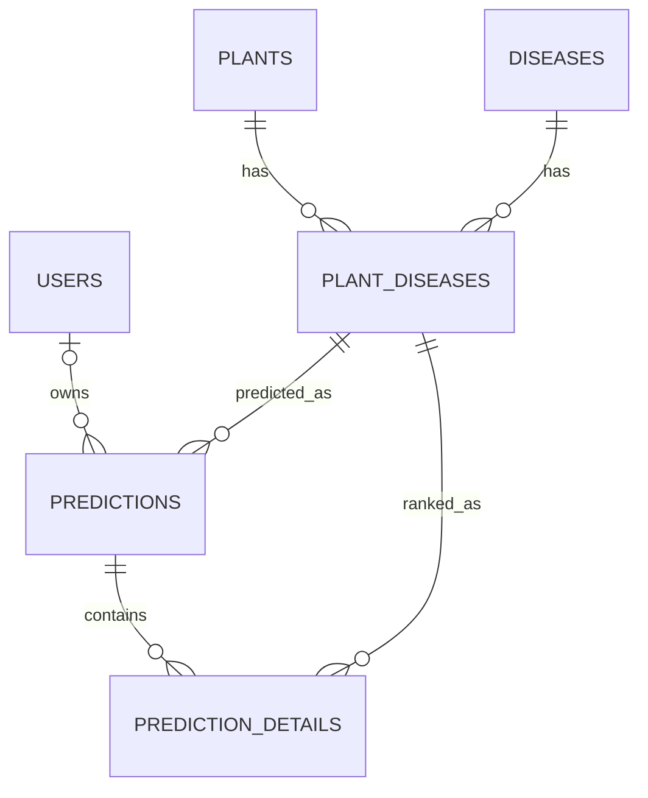

# Lộ trình phát triển AgriVision AI

> Đối chiếu mã nguồn với `main` commit `65082f6` và nhánh `AGRI-75-ci-testing-setup` ngày 2026-09-27.
> Model chưa có checkpoint được nhóm xác nhận đạt yêu cầu. Đây là kế hoạch;
> sự hiện diện của mã hoặc test không có nghĩa luồng dự đoán thật đã hoàn thành.

## 1. Mục tiêu và ranh giới

MVP phân loại bệnh lá bằng ConvNeXt-Tiny: Next.js (web) → ASP.NET Core Web API
(xác thực, nghiệp vụ, lịch sử) → FastAPI (suy luận) → checkpoint PyTorch.
PostgreSQL lưu tài khoản và metadata; nơi lưu ảnh cần chốt. Dataset v1.3 nằm
ngoài Git, dùng các manifest train/val/test cố định; không chia lại dữ liệu.
Kết quả phân loại là thông tin tham khảo, không phải chẩn đoán nông học chắc chắn.

**Model chưa sẵn sàng không chặn ERD, migration, DB tài khoản, auth, kiểm tra
upload hoặc UI mẫu.** Phần phụ thuộc checkpoint là mapping `class_index`/nhãn,
seed lớp bệnh chuẩn, dự đoán và lịch sử dự đoán thật. Không lưu kết quả giả vào
`predictions` để làm bằng chứng MVP.

## 2. Hiện trạng theo mã nguồn

| Thành phần | Đang có | Việc còn thiếu hoặc cần sửa |
|---|---|---|
| AI | `ai/train.py`, `ai/evaluate.py`, `ai/predict.py`, ConvNeXt-Tiny và pipeline v1.3 | Chưa có checkpoint phục vụ được xác nhận hoặc FastAPI inference service. CLI hiện trả confidence dạng phần trăm; hợp đồng HTTP chưa chốt. |
| Web | `frontend/` là React/Vite demo; có chọn ảnh, preview, trạng thái upload/lỗi và lịch sử localStorage | Chưa là Next.js. Client gửi multipart `image`, chờ `{crop,disease,confidence}` với confidence 0–1; chưa khớp ASP.NET Core. |
| API | ASP.NET Core 9 có register/login/me, JWT, danh mục, dự đoán và lịch sử | POST dự đoán nhận `File`; DTO khác web. `GET /api/predictions/{id}` chưa kiểm tra quyền sở hữu. Adapter AI trả dự đoán mặc định khi lỗi; service chọn lớp đầu tiên nếu không tìm thấy mapping. |
| DB | PostgreSQL 16 Compose, EF Core migration và 6 entity (`User`, `Plant`, `Disease`, `PlantDisease`, `Prediction`, `PredictionDetail`) | Có thể dùng DB cho auth ngay. Seed 11 lớp chỉ minh họa, chưa phải mapping v1.3; prediction chưa lưu model version. |
| CI/test | Workflow 5 job ở `.github/workflows/ci.yml`; có Python smoke, .NET unit/integration và build web | Workflow đã commit cục bộ, chưa có bằng chứng GitHub Actions. Chưa có test contract AI, upload xuyên tầng hoặc UI E2E. |

Ưu tiên xử lý credential/secret và tài khoản seed có mật khẩu cố định trong
backend trước khi chia sẻ môi trường. Không sao chép giá trị hiện có vào tài
liệu, fixture hoặc log. Phân biệt rõ demo/stub với kết quả model thật.

## 3. Yêu cầu MVP và quyết định cần chốt

| ID | Yêu cầu | Tiêu chí chấp nhận |
|---|---|---|
| FR-01 | Tải ảnh lá | Web và API dùng cùng tên field, loại ảnh, giới hạn dung lượng và cách báo lỗi; server xác thực nội dung ảnh. |
| FR-02 | Phân loại thật | FastAPI dùng checkpoint, preprocessing và mapping đã chốt; trả nhãn canonical, top-k, confidence thống nhất đơn vị, dataset/model version. AI lỗi không trả kết quả giả. |
| FR-03 | Lưu dự đoán | Chỉ tạo prediction sau khi kết quả AI và mapping hợp lệ; ảnh/bản ghi lỗi được xử lý theo chính sách lưu trữ. |
| FR-04 | Lịch sử cá nhân | Chỉ chủ sở hữu hoặc vai trò được cấp quyền xem/xóa từng bản ghi; phân trang và xóa ảnh theo chính sách. |
| FR-05 | Xác thực | Đăng ký, đăng nhập, `/me`, kiểm tra phiên/token và lỗi xác thực có test với DB riêng. |
| NFR-01 | Tái lập AI | Giữ nguyên split v1.3; chọn model bằng validation, dùng test sau khi chốt; CLI và HTTP dùng cùng preprocessing/mapping. |
| NFR-02 | Bảo mật | Secret ở ngoài Git; upload được giới hạn và kiểm tra ở server; quyền truy cập áp dụng cho từng prediction. |
| NFR-03 | Vận hành | Health/readiness thể hiện trạng thái DB/AI; migration và rollback được kiểm tra trước staging. |

Chốt sớm: khách chưa đăng nhập có được dự đoán không và ảnh của khách có được
lưu không; web giữ/gửi phiên đăng nhập theo cách nào; ai được xem/xóa ảnh;
giới hạn và thời hạn lưu ảnh; tên field multipart, schema response và đơn vị
confidence. Có thể chốt các việc này trước khi model đạt yêu cầu. Chỉ chốt seed
nhãn khi đã chọn checkpoint 58 lớp `compound` hay cặp baseline `plant`/`disease`
và có nguồn mapping canonical; không tự sắp xếp tên để sinh `class_index`.

## 4. ERD và hợp đồng dữ liệu

ERD dưới đây phản ánh **quan hệ đang có** trong entity/EF Core. Xác nhận cột,
khóa và ràng buộc bằng migration trước khi thay schema.

Làm ngay: tài liệu hóa quan hệ, tính tùy chọn của `Prediction.UserId`, unique
email, quyền sở hữu, nơi lưu tham chiếu ảnh và cách xóa ảnh. Dùng PostgreSQL
test để kiểm tra migration, auth và ràng buộc, không cần checkpoint. Thiết kế
`model_version`/`dataset_version` và metadata top-k trong hợp đồng; chỉ thêm
migration sau khi tên trường và nguồn giá trị được duyệt. Không seed mapping
11 lớp minh họa như mapping của model thật; không lưu checkpoint trong DB.

Hợp đồng upload cần mô tả request multipart, response thành công/lỗi, quyền
truy cập và side effect lên storage/DB. Kiểm tra loại,
kích thước và nội dung ảnh ở API; không tin tên file từ client khi lưu. Khi
chưa có AI service, dùng stub trong **test** để kiểm tra các nhánh upload/DB;
endpoint sản phẩm phải trả lỗi dịch vụ rõ ràng và không ghi prediction giả.

## 5. Thứ tự triển khai khi chưa có model

| Bước | Công việc | Cổng hoàn thành |
|---|---|---|
| 0. Bảo vệ môi trường | Xử lý secret/credential hiện có và tài khoản seed cố định; ghi trạng thái thực/demo/chờ | Không dùng credential thật trong Git hoặc fixture mới; test/report không gọi mock là dự đoán thật. |
| 1. ERD và contract | Đối chiếu ERD với migration; chốt quyền guest, ảnh, auth và schema upload/response | Có quyết định rõ cho các mục ở phần 3; contract web–API thống nhất. |
| 2. Auth và DB độc lập model | Hoàn thiện register/login/me, kiểm tra chủ sở hữu ở GET/DELETE prediction, migration và test A/B | Unit/integration với PostgreSQL test xác nhận user A không đọc/xóa dữ liệu B; không cần seed lớp bệnh chuẩn. |
| 3. Upload an toàn | Thống nhất `image`/`File`, giới hạn file, xác thực ảnh, lưu/xóa ảnh và lỗi AI/DB | Case API/unit/integration kiểm tra không lưu/gọi AI khi file sai, không tạo prediction khi AI lỗi. |
| 4. UI mẫu | Dùng React/Vite hiện có để kiểm tra chọn ảnh, preview, loading, hủy, lỗi; chuẩn bị Next.js theo kiến trúc đã chọn | UI ghi rõ trạng thái demo/model chưa sẵn sàng; screen test dùng stub và không hiển thị kết quả cũ như kết quả mới. |
| 5. Model và tích hợp | Huấn luyện/đánh giá trên split cố định; chốt checkpoint, mapping, inference contract; xây FastAPI và seed nhãn | Có experiment/metric được review; CLI–HTTP AI–.NET–web dùng cùng nhãn, preprocessing và đơn vị confidence trên ảnh chuẩn. |
| 6. CI/staging | Chạy full suite, contract/E2E, staging với checkpoint thật và dữ liệu test | Số test/artifact được ghi nhận; health, auth, upload, lịch sử và nhánh AI lỗi pass trước khi xét CD. |

Bước 1–4 có thể làm song song với huấn luyện ở bước 5. UI có thể dùng dữ liệu
stub để thiết kế, nhưng không lưu nó vào lịch sử thật. Không thêm endpoint upload
riêng chỉ để né việc chưa có model; kiểm tra upload qua lớp nghiệp vụ/test stub
trừ khi có use case độc lập được duyệt. Không chạy production CD chỉ vì health
gate và build pass.

## 6. Kiểm thử, phụ thuộc và tài liệu liên quan

Ưu tiên các case [viewpoint](notes/agri_test_viewpoints.md),
[API](notes/agri_api_test_cases.md), [unit](notes/agri_unit_test_cases.md),
[integration](notes/agri_integration_test_cases.md) và
[screen](notes/agri_screen_test_cases.md) theo từng bước ở trên. Ghi actual result,
commit, lệnh chạy, môi trường và bằng chứng theo
[kế hoạch kiểm thử](notes/testing_strategy.md). Test với AI stub chỉ xác nhận contract
và side effect; không chứng minh chất lượng phân loại.

Workflow hiện tại nằm tại [`.github/workflows/ci.yml`](../.github/workflows/ci.yml); xem
[báo cáo CI và kiểm thử](notes/testing_ci_execution_report.md) cho bằng chứng cục bộ
và giới hạn. Trước khi bật required checks hoặc CD, xác nhận workflow đã chạy
trên GitHub, branch đích theo quy tắc repo và cách cấp secret an toàn.
Chia thành các Jira task riêng; không tự đặt mã task, chủ sở hữu hoặc kết quả.
