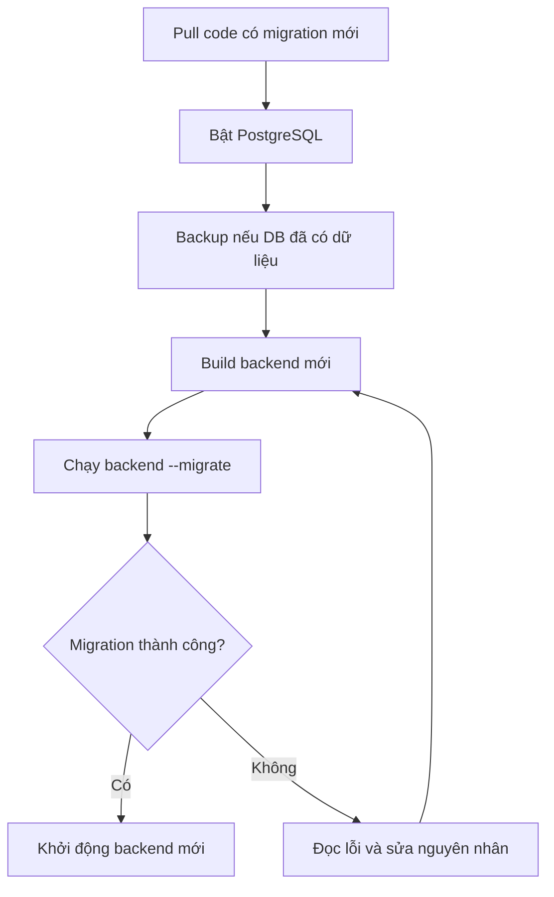
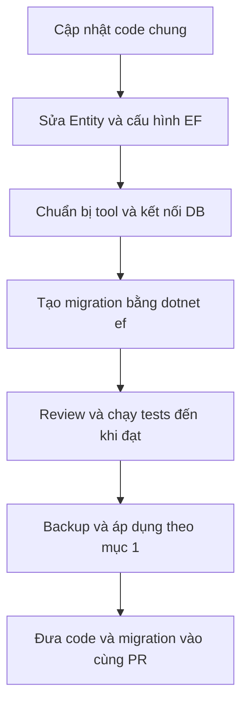
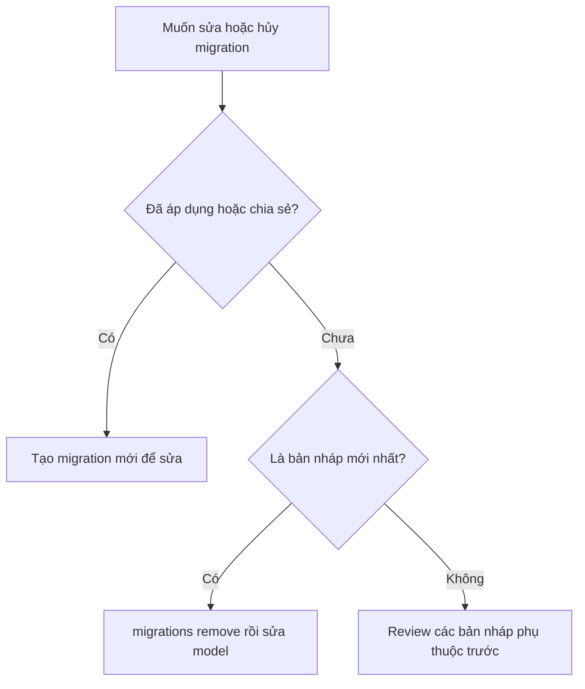

# Cách áp dụng và tạo migration database

Migration là file ghi lại thay đổi database, ví dụ thêm bảng hoặc cột. File nằm trong [backend/src/AgriVision.Infrastructure/Persistence/Migrations](../backend/src/AgriVision.Infrastructure/Persistence/Migrations/).

Có **hai việc thường gặp**:

- Đồng đội đã tạo migration, bạn pull về → làm **mục 1**.
- Bạn muốn thay đổi cấu trúc database → làm **mục 2**.

Chạy lệnh bằng **PowerShell tại thư mục gốc dự án**, mở Docker Desktop trước. Làm từng bước; nếu lệnh lỗi thì dừng, xử lý lỗi rồi mới tiếp tục.

## 1. Pull code có migration mới: áp dụng vào DB của mình

Ví dụ: `main` có migration thêm một cột. Sau khi bạn nhận code đó, DB trên máy bạn vẫn chưa có cột mới. Cần build backend mới rồi chạy migration; **không tạo lại migration**.



### Bước 1: Bật PostgreSQL và sao lưu DB

```powershell
docker compose up -d --wait postgres
```

Nếu DB đã có dữ liệu, backup trước khi cập nhật:

```powershell
New-Item -ItemType Directory -Force .cache/database-verification | Out-Null
$backupName = 'agrivision_' + [guid]::NewGuid().ToString('N') + '.dump'
docker compose exec -T postgres pg_dump -U agrivision_user -d agrivision_db -Fc -f "/tmp/$backupName"
if ($LASTEXITCODE -ne 0) { throw 'Backup lỗi; không chạy migration' }
docker compose cp "postgres:/tmp/$backupName" ".cache/database-verification/$backupName"
if ($LASTEXITCODE -ne 0) { throw 'Copy backup lỗi; không chạy migration' }
docker compose exec -T postgres rm -- "/tmp/$backupName"
```

File backup được giữ trong `.cache/database-verification`, không đưa lên Git.

### Bước 2: Build backend từ code vừa nhận

```powershell
docker compose build backend
```

### Bước 3: Áp dụng migration

```powershell
docker compose run --rm --no-deps backend --migrate
```

Lệnh này chạy các migration còn thiếu rồi thoát. Migration đã chạy sẽ được bỏ qua. Không cần mở file SQL và chạy thủ công.

### Bước 4: Khởi động backend bằng image mới

```powershell
docker compose up -d --no-deps --wait backend
```

Backend bình thường chỉ kiểm tra migration, không tự cập nhật DB khi mở API. Nếu API báo pending migrations, kiểm tra lại bước 2–3.

## 2. Muốn thay đổi database: tạo migration mới

Cần **.NET SDK 9**. Ví dụ: bạn muốn thêm một thuộc tính cho `Plant`.

Cập nhật code chung trước khi tạo migration để giảm xung đột với thay đổi của đồng đội.



### Bước 1: Sửa Entity và cấu hình EF

- Entity: `backend/src/AgriVision.Domain/Entities`.
- DbContext/configuration: `backend/src/AgriVision.Infrastructure/Persistence`.

Sửa model trong code trước để EF biết cần tạo thay đổi gì.

### Bước 2: Chuẩn bị tool và kết nối DB

```powershell
dotnet tool restore
docker compose up -d --wait postgres

# Lấy connection từ .env/Compose, đổi sang địa chỉ truy cập từ máy host
$composeSettings = docker compose config --format json | ConvertFrom-Json
$dbPort = [string]$composeSettings.services.postgres.ports[0].published
$env:ConnectionStrings__DefaultConnection = $composeSettings.services.backend.environment.ConnectionStrings__DefaultConnection.Replace('Host=postgres;', 'Host=127.0.0.1;').Replace('Port=5432;', "Port=$dbPort;")
```

Chạy các bước tiếp theo trong cùng cửa sổ PowerShell. Không in hoặc commit connection string vì có password.

### Bước 3: Tạo migration

Thay `AddPlantField` bằng tên mô tả thay đổi của bạn:

```powershell
dotnet ef migrations add AddPlantField --project backend/src/AgriVision.Infrastructure --startup-project backend/src/AgriVision.API --output-dir Persistence/Migrations
```

EF sinh file migration và cập nhật model snapshot. Đọc `Up()` để kiểm tra thay đổi sẽ áp dụng, `Down()` để kiểm tra cách hoàn tác. Chú ý các thao tác xóa bảng/cột vì có thể mất dữ liệu.

### Bước 4: Kiểm thử rồi áp dụng

Thêm test cho thay đổi mới và chạy tests:

```powershell
dotnet test backend/AgriVision.sln
```

Integration tests dùng PostgreSQL container riêng, không dùng DB ứng dụng.

Tests đạt thì **làm lại mục 1** để backup, build và áp dụng migration vừa tạo. Nếu muốn áp dụng trực tiếp bằng dotnet, sau backup dùng lệnh sau thay cho job `--migrate`:

```powershell
dotnet ef database update --project backend/src/AgriVision.Infrastructure --startup-project backend/src/AgriVision.API
```

Sau đó vẫn build/khởi động lại backend Docker để image khớp code mới.

### Bước 5: Chia sẻ cùng code

Đưa thay đổi Entity/configuration, migration C#, Designer và `AppDbContextModelSnapshot.cs` vào cùng PR. Đồng đội nhận code rồi làm mục 1.

Khi xong các lệnh dotnet, xóa biến chứa cấu hình khỏi phiên PowerShell:

```powershell
Remove-Item Env:ConnectionStrings__DefaultConnection
Remove-Variable composeSettings
```

## 3. Một vài lệnh và lưu ý cần nhớ

**Xem migration đã áp dụng trong DB:**

```powershell
@'
SELECT "MigrationId" FROM "__EFMigrationsHistory" ORDER BY "MigrationId";
'@ | docker compose exec -T postgres psql -U agrivision_user -d agrivision_db -P pager=off
```

**Hủy migration mới nhất, chưa áp dụng và chưa chia sẻ:** chuẩn bị tool/connection như mục 2, rồi chạy:



```powershell
dotnet ef migrations remove --project backend/src/AgriVision.Infrastructure --startup-project backend/src/AgriVision.API
```

Điều chỉnh lại model nếu bỏ thay đổi. Migration đã áp dụng hoặc chia sẻ thì sửa bằng migration mới; không xóa file/history để làm lại. Riêng `DatasetV14Catalog` không hỗ trợ rollback.

- Không dùng `docker compose down -v`: lệnh này xóa cả volume chứa dữ liệu.
- Khi API/DB lỗi, xem `docker compose logs --tail 80 backend postgres`.
- Dự án mới: copy `.env.example` thành `.env`, điền `POSTGRES_PASSWORD` và `JWT_SECRET` (ít nhất 32 UTF-8 bytes); chạy `docker compose build`, làm mục 1 (bỏ backup nếu DB mới), rồi `docker compose up -d --wait` để mở cả web/API/DB.
- Migration `DatasetV14Catalog` đã nạp 59 lớp active v1.4; không cần import catalog SQL thêm.

## 4. Các trường hợp khác khi làm việc nhóm

**Hai người cùng tạo migration:** cập nhật code chung trước khi tạo migration mới. Nếu conflict migration hoặc model snapshot, kiểm tra thay đổi của cả hai người và giữ đủ Entity/configuration. Snapshot phải khớp toàn bộ model sau khi gộp; không chọn bừa một phía. Review và chạy tests theo mục 2 trước khi áp dụng; không sửa migration đã chia sẻ để xử lý conflict.

**Migration chạy bị lỗi:** đọc lỗi trực tiếp từ lệnh `--migrate`, sửa nguyên nhân rồi chạy lại. Job dùng `--rm` sẽ bị xóa sau khi thoát; logs của backend HTTP không thay thế output của job. Kiểm tra EF history ở mục 3 nếu cần biết bản nào đã hoàn tất. Không xóa volume/history và không mặc định rằng mọi thay đổi đều đã rollback.

**Chỉ cập nhật dữ liệu, không đổi bảng/cột:** làm theo mục 2, đặt tên migration như `UpdateCatalog`. EF có thể sinh `Up()`/`Down()` rỗng vì model không thay đổi. Thêm thao tác cập nhật dữ liệu vào `Up()`, chẳng hạn dùng `migrationBuilder.Sql(...)`; kiểm tra cách hoàn tác trong `Down()` và test bảo toàn dữ liệu. Sau đó backup và áp dụng như mục 1. Không sửa migration catalog cũ đã áp dụng.

**Chuyển branch có schema khác:** chuyển Git branch không tự đổi schema DB. Nếu code branch mới không tương thích với DB hiện tại, dùng database/volume riêng cho branch đó và áp dụng migration của nó. Giữ DB/volume cũ; không xóa dữ liệu hoặc rollback tùy tiện để ép schema khớp branch.
