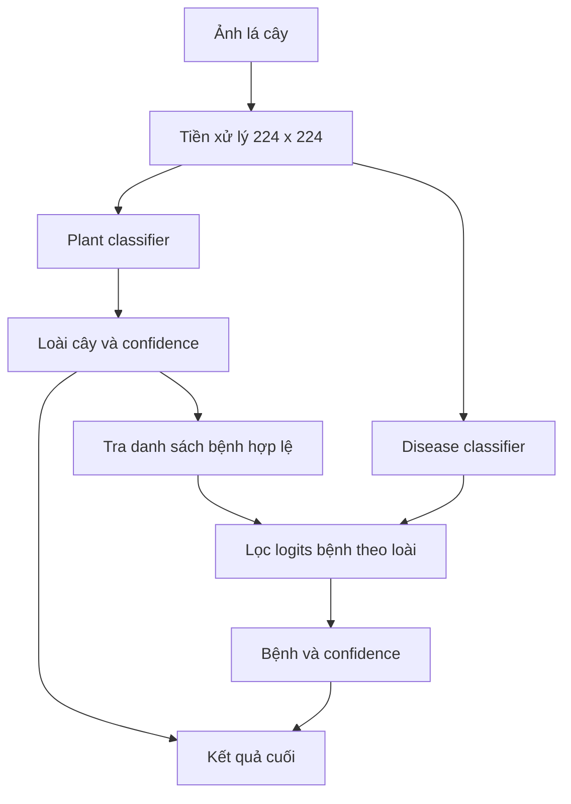

# Báo cáo mô hình nhận diện loài cây và bệnh lá

## 1. Thông tin chung

- **Tên hệ thống:** AgriVision AI
- **Mô hình:** ConvNeXt-Tiny
- **Bài toán:** Phân loại ảnh lá cây
- **Dataset:** `v1.3`
- **Kích thước đầu vào:** `224 x 224 x 3`
- **Framework:** PyTorch và Torchvision
- **Hai nhánh phân loại:** loài cây và bệnh lá
- **Ngày cập nhật báo cáo:** 2026-09-26

## 2. Tóm tắt

Hệ thống sử dụng ConvNeXt-Tiny pretrained trên ImageNet-1K để giải quyết hai
bài toán liên quan đến ảnh lá cây. Mô hình thứ nhất phân loại 10 loài cây. Mô
hình thứ hai phân loại 45 tình trạng bệnh hoặc khỏe mạnh. Hai mô hình có cùng
backbone nhưng được huấn luyện độc lập, sử dụng classification head và
checkpoint riêng.

Quá trình huấn luyện được chia thành hai giai đoạn. Trong ba epoch đầu, backbone
được đóng băng để huấn luyện classification head. Từ epoch thứ tư, toàn bộ mô
hình được mở khóa và fine-tune với learning rate nhỏ. Checkpoint tốt nhất được
chọn theo macro-F1 trên validation set rồi đánh giá một lần trên test set cố
định.

Baseline plant đạt accuracy và macro-F1 bằng `1.000000` trên 16.415 ảnh test.
Baseline disease đạt accuracy `0.973073` và macro-F1 `0.935802`. Kết quả plant
rất cao nhưng chưa đủ để khẳng định khả năng tổng quát trên ảnh thực tế do
dataset chưa có metadata nguồn ảnh chi tiết.

## 3. Bài toán cần giải quyết

### 3.1. Nhận diện loài cây

Đầu vào là một ảnh lá cây. Mô hình trả về một trong 10 nhãn loài:

```text
Ca_chua, Ca_phe, Cam, Che, Lua,
Ngo, Nho, Ot, Sau_rieng, Xoai
```

Nhánh này giúp xác định bối cảnh sinh học của ảnh trước khi chẩn đoán bệnh.
Thông tin loài cây còn được dùng để giới hạn danh sách bệnh hợp lệ ở bước
inference kết hợp.

### 3.2. Nhận diện bệnh

Đầu vào cũng là ảnh lá cây. Mô hình trả về một trong 45 nhãn bệnh hoặc tình
trạng khỏe mạnh. Bài toán này khó hơn do:

- số lớp lớn hơn;
- số lượng ảnh giữa các lớp không đồng đều;
- một số bệnh có triệu chứng thị giác tương tự;
- một số nhãn trong dataset chỉ khác nhau bởi chữ hoa và chữ thường;
- một số lớp hiếm có rất ít ảnh đánh giá.

## 4. Dữ liệu huấn luyện và đánh giá

Dataset được chia sẵn bằng ba manifest CSV. Pipeline không tạo split ngẫu nhiên
khi train, nhờ đó các lần thí nghiệm sử dụng cùng một tập dữ liệu.

| Split | Số lượng ảnh | Vai trò |
|---|---:|---|
| Train | 57.449 | Cập nhật trọng số mô hình |
| Validation | 8.209 | Chọn checkpoint và early stopping |
| Test | 16.415 | Báo cáo kết quả cuối cùng |

Pipeline dữ liệu kiểm tra:

- manifest có đủ cột bắt buộc;
- ảnh được đánh dấu `valid`;
- đường dẫn ảnh tồn tại và không đi ra ngoài thư mục dataset;
- `compound_label` khớp với loài cây và bệnh;
- một ảnh không xuất hiện trong nhiều split;
- một `group_id` không xuất hiện ở nhiều split;
- tập nhãn của train, validation và test giống nhau.

Các kiểm tra trên hạn chế rò rỉ trực tiếp, nhưng chưa kiểm tra được ảnh gần trùng
từ cùng nguồn chụp nếu dataset không cung cấp `source_id` hoặc `capture_id`.

## 5. Tiền xử lý ảnh

### 5.1. Trong quá trình train

Ảnh train sử dụng các augmentation cơ bản:

- `RandomHorizontalFlip(p=0.5)`;
- `RandomRotation(degrees=15)`;
- `ColorJitter` với brightness, contrast và saturation bằng `0.2`;
- chuyển ảnh thành tensor;
- chuẩn hóa bằng mean và standard deviation của ImageNet.

Augmentation giúp mô hình giảm phụ thuộc vào hướng lá, góc chụp và điều kiện
ánh sáng. Validation và test không dùng augmentation ngẫu nhiên.

### 5.2. Khi dự đoán ảnh bên ngoài

Ảnh đầu vào có kích thước bất kỳ được:

1. chuyển sang RGB;
2. resize bằng Lanczos trong khi giữ nguyên tỷ lệ;
3. đặt vào giữa khung vuông `224 x 224`;
4. đệm phần trống bằng màu nền cố định;
5. chuẩn hóa theo ImageNet.

Cách xử lý này tránh kéo dãn hình dạng lá. Nếu ảnh gốc có độ phân giải thấp
hoặc bị mờ, resize lên `224 x 224` không thể khôi phục chi tiết đã mất.

## 6. Kiến trúc ConvNeXt-Tiny

ConvNeXt là kiến trúc convolutional neural network hiện đại, sử dụng các cải
tiến về block, normalization và chiến lược thiết kế lấy cảm hứng từ Vision
Transformer trong một mạng CNN thuần túy.

Mô hình trong dự án được khởi tạo từ trọng số ImageNet-1K. Linear layer cuối
của mô hình gốc được thay bằng:

```text
LayerNorm -> Flatten -> Dropout(0.2) -> Linear(768, số_lớp)
```

Thống kê tham số được đo trực tiếp từ implementation hiện tại:

| Mô hình | Số lớp đầu ra | Tổng số tham số | Tham số classifier |
|---|---:|---:|---:|
| Plant | 10 | 27.827.818 | 9.226 |
| Disease | 45 | 27.854.733 | 36.141 |

Phần lớn tham số nằm trong backbone. Việc dùng pretrained weights giúp mô hình
tận dụng các đặc trưng hình ảnh đã học trước thay vì huấn luyện từ đầu.

## 7. Chiến lược huấn luyện

### 7.1. Giai đoạn linear probing

Trong ba epoch đầu, các tham số trong `backbone.features` bị đóng băng. Chỉ
classification head được cập nhật. Mục đích là để head thích nghi với hệ thống
nhãn mới mà không làm thay đổi đột ngột pretrained features.

### 7.2. Giai đoạn fine-tune

Từ epoch thứ tư, toàn bộ mô hình được mở khóa. Backbone sử dụng learning rate
`3e-5`, thấp hơn 10 lần so với learning rate `3e-4` của classification head.
Đây là discriminative learning rate: feature pretrained thay đổi chậm, trong
khi head mới có thể học nhanh hơn.

### 7.3. Cấu hình huấn luyện

| Thành phần | Cấu hình |
|---|---|
| Optimizer | AdamW |
| Weight decay | `0.05` |
| Loss | CrossEntropyLoss |
| Label smoothing | `0.1` |
| Scheduler | Linear warmup và cosine decay |
| Warmup | 3 epoch |
| Minimum LR factor | `0.01` |
| Batch size | 8 |
| Gradient accumulation | 4 bước |
| Batch hiệu dụng | 32 |
| Gradient clipping | `1.0` |
| Mixed precision | Có khi dùng CUDA |
| Số epoch baseline | 10 |
| Early stopping patience | 7 epoch |
| Random seed | 42 |

Task disease sử dụng class-weighted loss. Trọng số được tính từ tần suất từng
lớp trong train set nhằm tăng ảnh hưởng của các lớp hiếm. Task plant không dùng
class weights.

## 8. Tiêu chí lựa chọn mô hình

Metric chính để chọn checkpoint là **macro-F1 trên validation set**. Macro-F1
tính F1 cho từng lớp rồi lấy trung bình không trọng số, vì vậy mỗi lớp đóng góp
như nhau dù số ảnh khác nhau.

Các metric được báo cáo gồm:

- **Accuracy:** tỷ lệ dự đoán đúng trên toàn bộ mẫu;
- **Precision macro:** độ chính xác trung bình của các dự đoán theo lớp;
- **Recall macro:** khả năng thu hồi trung bình theo lớp;
- **Macro-F1:** trung bình F1 của tất cả lớp;
- **Weighted-F1:** F1 trung bình có trọng số theo số mẫu;
- **Balanced accuracy:** recall trung bình của các lớp;
- **Confusion matrix:** số lượng nhầm lẫn giữa từng cặp lớp.

Accuracy không đủ để đánh giá riêng task disease vì lớp phổ biến có thể che
khuất hiệu năng yếu ở các lớp hiếm.

## 9. Kết quả thực nghiệm

### 9.1. Nhận diện loài cây

Checkpoint tốt nhất được lưu tại epoch 8.

| Metric | Validation tốt nhất | Test |
|---|---:|---:|
| Accuracy | `0.999147` | `1.000000` |
| Macro-F1 | `0.992100` | `1.000000` |
| Precision macro | Không ghi trong summary validation | `1.000000` |
| Recall macro | Không ghi trong summary validation | `1.000000` |
| Balanced accuracy | Không ghi trong summary validation | `1.000000` |

Mô hình dự đoán đúng toàn bộ 16.415 ảnh test. Precision, recall và F1 của cả 10
lớp đều bằng `1.0000`; confusion matrix không có phần tử ngoài đường chéo.

Kết quả cho thấy model phân biệt rất tốt các loài trong test split hiện tại.
Tuy nhiên, mức 100% cũng là dấu hiệu cần kiểm tra chất lượng split. Có thể các
loài có đặc điểm nền hoặc cách thu thập rất khác nhau, hoặc train và test chứa
ảnh gần giống từ cùng nguồn. Do thiếu metadata nguồn ảnh, chưa thể loại trừ các
khả năng này chỉ bằng manifest hiện tại.

### 9.2. Nhận diện bệnh

Checkpoint tốt nhất được lưu tại epoch 10.

| Metric | Validation tốt nhất | Test |
|---|---:|---:|
| Accuracy | `0.966622` | `0.973073` |
| Macro-F1 | `0.931624` | `0.935802` |
| Precision macro | Không ghi trong summary validation | `0.933218` |
| Recall macro | Không ghi trong summary validation | `0.959292` |
| Weighted-F1 | Không ghi trong summary validation | `0.980542` |
| Balanced accuracy | Không ghi trong summary validation | `0.959292` |

Model dự đoán sai 442 trên 16.415 ảnh test. Năm nhầm lẫn lớn nhất:

| Nhãn thật | Nhãn dự đoán | Số lượng |
|---|---|---:|
| `Khoe_manh` | `Dom_than_la` | 227 |
| `Khoe_manh` | `Sau_gai_an_la` | 30 |
| `Chay_la` | `Dom_la_xam` | 15 |
| `Chay_la` | `Sau_gai_an_la` | 11 |
| `Dom_la_xam` | `Chay_la` | 11 |

Sai số lớn nhất đến từ việc ảnh khỏe mạnh bị nhận thành đốm thân lá. Lớp
`Dom_than_la` chỉ có 8 mẫu test nhưng có class weight cao, làm mô hình có xu
hướng dự đoán quá mức lớp này. Chênh lệch giữa macro-F1 `0.935802` và
weighted-F1 `0.980542` cũng cho thấy model làm tốt hơn trên các lớp đông mẫu so
với một số lớp hiếm.

## 10. Pipeline dự đoán cuối

Hai checkpoint được kết hợp theo pipeline phân cấp:



Việc lọc disease logits theo loài cây giúp kết quả có tính nhất quán sinh học.
Ví dụ, nếu giai đoạn đầu nhận diện `Ca_chua`, giai đoạn bệnh chỉ so sánh các
nhãn bệnh được định nghĩa cho cà chua.

Pipeline vẫn phụ thuộc vào dự đoán loài cây. Nếu plant classifier dự đoán sai,
danh sách bệnh hợp lệ cũng bị chọn sai. Vì vậy confidence của cả hai giai đoạn
cần được trả về để ứng dụng có thể từ chối hoặc yêu cầu người dùng chụp lại khi
độ tin cậy thấp.

## 11. Artifact của mô hình

Mỗi task tạo các artifact sau:

```text
ai/checkpoints/<task>/
├── best_convnext_tiny.pth
├── last_convnext_tiny.pth
└── class_to_idx.json

ai/outputs/<task>/
├── training_history.json
├── training_summary.json
├── training_history.png
├── test_metrics.json
├── classification_report.txt
├── test_confusion_matrix.png
├── top_confusions.csv
└── misclassified_samples.csv
```

Trong máy local hiện có checkpoint `best`, `last`, class mapping và các báo cáo
test cho cả plant lẫn disease. Checkpoint plant có dung lượng khoảng 318,69 MiB;
checkpoint disease khoảng 319,00 MiB.

File `.pth` chứa trọng số đã học và metadata cần thiết như số lớp, class
mapping, epoch, validation metrics và optimizer state. Nó không chứa dataset.

## 12. Cách sử dụng mô hình

### 12.1. Đánh giá checkpoint

```powershell
$env:AGRIVISION_DATASET_DIR = "D:\AgriVisionAI_Data\v1.3"
python -m ai.evaluate --task plant
python -m ai.evaluate --task disease
```

### 12.2. Dự đoán một ảnh bằng pipeline kết hợp

```powershell
python -m ai.predict --image "D:\1.jpg" --topk 3
```

Mặc định chương trình sử dụng:

```text
ai/checkpoints/plant/best_convnext_tiny.pth
ai/checkpoints/disease/best_convnext_tiny.pth
```

Kết quả gồm loài cây, bệnh, confidence của từng giai đoạn và Top-K dự đoán.

## 13. Hạn chế

1. Kết quả plant 100% mới được đo trên test split nội bộ.
2. Dataset chưa có đủ metadata để kiểm tra ảnh gần trùng theo nguồn chụp.
3. Một số nhãn disease chưa được chuẩn hóa chữ hoa và chữ thường.
4. Class-weighted loss có thể làm model ưu tiên quá mức lớp cực hiếm.
5. Chưa có kết quả chính thức trên ảnh thực địa độc lập.
6. Chưa đo inference time trên thiết bị triển khai mục tiêu.
7. Pipeline phân cấp có thể lan truyền lỗi từ bước nhận diện loài cây sang bước
   nhận diện bệnh.
8. Ảnh nhỏ, mờ, thiếu sáng hoặc có nhiều lá có thể khác đáng kể so với dữ liệu
   huấn luyện.

## 14. Hướng cải tiến

### Ưu tiên cao

- Tạo external test set từ ảnh chụp mới và không dùng trong quá trình phát
  triển.
- Dùng perceptual hash hoặc embedding để phát hiện ảnh gần trùng giữa các split.
- Chuẩn hóa taxonomy và gộp các nhãn disease trùng về ngữ nghĩa.
- Rà soát class weights, đặc biệt đối với `Dom_than_la`.
- So sánh weighted loss với focal loss hoặc sampler cân bằng.

### Thử nghiệm mô hình

- Train lại plant với augmentation mạnh hơn trên Kaggle.
- So sánh input `224 x 224` và độ phân giải lớn hơn nếu ảnh gốc đủ chi tiết.
- Thử MixUp hoặc CutMix với mức độ phù hợp cho tổn thương lá.
- Calibrate confidence bằng temperature scaling.
- Thêm cơ chế từ chối dự đoán khi confidence thấp.
- So sánh pipeline hai giai đoạn với mô hình multi-task dùng chung backbone.

## 15. Kết luận

Hai baseline ConvNeXt-Tiny đã tạo được một hệ thống phân loại hoàn chỉnh từ dữ
liệu, huấn luyện, checkpoint, đánh giá đến inference. Nhánh plant đạt kết quả
rất cao trên test nội bộ, còn nhánh disease đạt accuracy khoảng 97,31% và
macro-F1 khoảng 93,58%. Kết quả disease cho thấy mô hình đã học được phần lớn
các biểu hiện bệnh nhưng vẫn gặp khó khăn ở lớp hiếm và các bệnh có biểu hiện
gần nhau.

Mô hình hiện phù hợp làm baseline kỹ thuật và nền tảng cho pipeline dự đoán hai
giai đoạn. Trước khi sử dụng trong môi trường thực tế, cần ưu tiên kiểm tra rò rỉ
dữ liệu, đánh giá trên ảnh độc lập, chuẩn hóa nhãn và hiệu chỉnh độ tin cậy.

