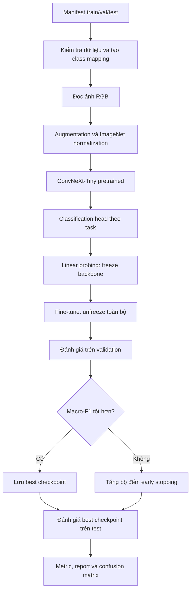
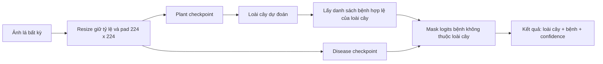

# Báo cáo quá trình xây dựng và huấn luyện mô hình AgriVision AI

**Ngày cập nhật:** 2026-09-26  
**Nhánh làm việc:** `feature/Model_Plant_Species_Classification`  
**Phạm vi:** Phân loại loài cây và bệnh lá bằng ConvNeXt-Tiny  
**Dataset:** `v1.3`

## 1. Mục tiêu công việc

Công việc được thực hiện nhằm xây dựng hai mô hình phân loại độc lập:

1. **Plant Species Classification:** nhận diện loài cây từ ảnh lá.
2. **Disease Classification:** nhận diện tình trạng bệnh của lá.

Hai mô hình dùng chung kiến trúc ConvNeXt-Tiny nhưng có classification head,
số lớp, checkpoint và thư mục kết quả riêng. Sau khi hai mô hình hoàn thành,
pipeline dự đoán kết hợp chạy theo hai giai đoạn: dự đoán loài cây trước, sau đó
chỉ xét các bệnh hợp lệ của loài cây vừa nhận diện.

## 2. Cấu trúc dữ liệu đã sử dụng

Dataset `v1.3` được tổ chức theo cấu trúc:

```text
v1.3/
├── images/
├── manifests/
│   ├── train.csv
│   ├── val.csv
│   └── test.csv
├── metadata/
└── reports/
```

Mỗi manifest phải có các trường chính:

- `image_path`: đường dẫn tương đối của ảnh trong `images/`;
- `plant`: nhãn loài cây;
- `condition`: nhãn bệnh hoặc tình trạng khỏe mạnh;
- `compound_label`: nhãn kết hợp theo dạng `plant___condition`;
- `group_id`: nhóm ảnh dùng để kiểm tra rò rỉ giữa các split;
- `split`: một trong `train`, `val`, `test`;
- `status`: bản ghi hợp lệ phải có giá trị `valid`.

Các split được đọc trực tiếp từ manifest và không được chia lại lúc train. Code
kiểm tra đường dẫn ảnh, cột bắt buộc, nhãn kết hợp, sự trùng ảnh và rò rỉ
`group_id` giữa các split. Số lượng được ghi nhận trong lần train baseline:

| Split | Số ảnh |
|---|---:|
| Train | 57.449 |
| Validation | 8.209 |
| Test | 16.415 |

Task plant có **10 lớp loài cây**. Task disease có **45 lớp bệnh/tình trạng**.

## 3. Kiến trúc mô hình

Mô hình sử dụng `ConvNeXt-Tiny` pretrained trên ImageNet-1K. Classification
head mặc định được thay bằng:

```text
Dropout(p=0.2) -> Linear(768, num_classes)
```

Số đầu ra thay đổi theo task:

| Task | Target trong manifest | Số lớp | Class-weighted loss |
|---|---|---:|---|
| `plant` | `plant` | 10 | Không |
| `disease` | `condition` | 45 | Có |

Mỗi task tạo artifact riêng:

```text
ai/checkpoints/plant/
ai/checkpoints/disease/
ai/outputs/plant/
ai/outputs/disease/
runs/plant/
runs/disease/
```

## 4. Luồng xử lý khi huấn luyện



### 4.1. Tiền xử lý ảnh

- Ảnh được chuyển sang RGB.
- Ảnh train dùng lật ngang, xoay và thay đổi độ sáng, tương phản, độ bão hòa.
- Ảnh được chuyển thành tensor và chuẩn hóa bằng mean/std của ImageNet.
- Ảnh inference có kích thước bất kỳ được resize giữ nguyên tỷ lệ, sau đó đệm
  vào khung `224 x 224` bằng Lanczos. Cách này tránh kéo méo lá theo chiều ngang
  hoặc dọc.
- Dataset `v1.3` hiện đã được chuẩn hóa về `224 x 224`, nên validation và test
  không resize lại.

### 4.2. Chiến lược fine-tune

- Ba epoch đầu: freeze phần trích xuất đặc trưng, chỉ cập nhật classifier head.
- Từ epoch 4: unfreeze toàn bộ mô hình và fine-tune với learning rate nhỏ hơn
  cho backbone.
- Optimizer: AdamW.
- Scheduler: linear warmup rồi cosine decay.
- Gradient accumulation: 4 mini-batch.
- Gradient clipping: `max_norm=1.0`.
- Mixed precision được bật khi có CUDA.
- Checkpoint tốt nhất được chọn bằng validation macro-F1.
- Early stopping sau 7 epoch liên tiếp không cải thiện.

### 4.3. Cấu hình baseline đã chạy

| Tham số | Giá trị |
|---|---:|
| Input size | `224 x 224` |
| Epoch | 10 |
| Batch size vật lý | 8 |
| Batch size hiệu dụng | 32 |
| Freeze epochs | 3 |
| Warmup epochs | 3 |
| Backbone learning rate | `3e-5` |
| Head learning rate | `3e-4` |
| Weight decay | `0.05` |
| Label smoothing | `0.1` |
| Dropout | `0.2` |
| Seed | 42 |

Task disease dùng trọng số lớp tính từ tần suất của tập train. Task plant không
dùng class weights.

## 5. Kết quả mô hình nhận diện loài cây

Checkpoint tốt nhất của baseline plant được lưu tại epoch 8.

| Chỉ số | Validation tốt nhất | Test |
|---|---:|---:|
| Accuracy | `0.999147` | `1.000000` |
| Macro-F1 | `0.992100` | `1.000000` |
| Balanced accuracy | Chưa ghi riêng trong báo cáo baseline | `1.000000` |
| Precision macro | Chưa ghi riêng trong báo cáo baseline | `1.000000` |
| Recall macro | Chưa ghi riêng trong báo cáo baseline | `1.000000` |

Test split gồm 16.415 ảnh và không có mẫu bị phân loại sai. Kết quả 100% cần
được hiểu thận trọng: manifest chưa có `source_id`, `capture_id`, vị trí chụp
hoặc ID cây/lá. Kiểm tra hiện tại ngăn trùng đường dẫn và rò rỉ `group_id`, nhưng
chưa chứng minh các split không chứa ảnh rất giống nhau từ cùng nguồn. Vì vậy,
kết quả này chưa thay thế đánh giá trên ảnh chụp thực địa hoặc nguồn độc lập.

Artifact hiện có:

```text
ai/checkpoints/plant/best_convnext_tiny.pth
ai/checkpoints/plant/last_convnext_tiny.pth
ai/checkpoints/plant/class_to_idx.json
ai/outputs/plant/classification_report.txt
ai/outputs/plant/test_metrics.json
ai/outputs/plant/test_confusion_matrix.png
ai/outputs/plant/top_confusions.csv
ai/outputs/plant/misclassified_samples.csv
```

## 6. Kết quả mô hình nhận diện bệnh

Checkpoint tốt nhất của baseline disease được lưu tại epoch 10.

| Chỉ số | Validation tốt nhất | Test |
|---|---:|---:|
| Accuracy | `0.966622` | `0.973073` |
| Macro-F1 | `0.931624` | `0.935802` |
| Weighted-F1 | Chưa ghi riêng trong validation | `0.980542` |
| Balanced accuracy | Chưa ghi riêng trong báo cáo baseline | `0.959292` |
| Precision macro | Chưa ghi riêng trong báo cáo baseline | `0.933218` |
| Recall macro | Chưa ghi riêng trong báo cáo baseline | `0.959292` |

Model dự đoán sai 442 trên 16.415 ảnh test. Những nhầm lẫn lớn nhất gồm:

| Nhãn thật | Nhãn dự đoán | Số ảnh |
|---|---|---:|
| `Khoe_manh` | `Dom_than_la` | 227 |
| `Khoe_manh` | `Sau_gai_an_la` | 30 |
| `Chay_la` | `Dom_la_xam` | 15 |
| `Chay_la` | `Sau_gai_an_la` | 11 |
| `Dom_la_xam` | `Chay_la` | 11 |

`Dom_than_la` chỉ có 8 mẫu test và có precision rất thấp. Trọng số lớp cao do
mất cân bằng đã làm model dự đoán lớp này quá mức. Dataset còn tồn tại một số
nhãn chỉ khác nhau ở chữ hoa/thường, ví dụ `Khoe_manh`/`khoe_manh` và
`Than_thu`/`than_thu`; đây là điểm cần chuẩn hóa trong phiên bản dataset sau.

Artifact hiện có tương tự task plant và được lưu trong
`ai/checkpoints/disease/` cùng `ai/outputs/disease/`.

## 7. Pipeline dự đoán kết hợp hai giai đoạn

Pipeline inference đang được thiết kế để người dùng chỉ truyền vào **một ảnh**:



Điểm quan trọng là disease model vẫn xử lý cùng ảnh đầu vào, nhưng logits của
những bệnh thuộc loài cây khác bị loại trước khi softmax và chọn Top-K. Cách này
ngăn trường hợp ảnh cà chua được gán bệnh chỉ tồn tại trên ớt hoặc cây khác.

Các file liên quan trong working tree:

- `ai/predict.py`: chạy một checkpoint hoặc pipeline kết hợp hai checkpoint;
- `ai/configs/plant_disease_mapping.py`: ánh xạ loài cây sang bệnh hợp lệ;
- `ai/tasks/agri_21/tests/test_predict.py`: kiểm tra ghép hai giai đoạn và lọc
  nhãn bệnh khác loài.

Các thay đổi inference trên đang ở working tree tại thời điểm viết tài liệu;
cần hoàn tất kiểm tra và commit riêng trước khi xem là bản phát hành ổn định.

## 8. Notebook train lại plant trên Kaggle

Notebook `notebooks/01_train_plant_kaggle.ipynb` được tạo để chạy riêng task
plant trên Kaggle. Notebook thực hiện:

1. kiểm tra GPU;
2. tìm source code trong Kaggle Input hoặc clone đúng branch từ GitHub;
3. tự tìm dataset đã giải nén hoặc giải nén file ZIP/RAR;
4. đặt `AGRIVISION_DATASET_DIR` theo đường dẫn tìm được;
5. cài các dependency còn thiếu mà không thay PyTorch CUDA của Kaggle;
6. kiểm tra 10 lớp plant và thử một batch `3 x 224 x 224`;
7. kích hoạt augmentation plant mạnh hơn trong runtime;
8. train, evaluate và hiển thị biểu đồ;
9. đóng gói checkpoint cùng báo cáo thành
   `/kaggle/working/plant_training_results.zip`.

Cấu hình mặc định của notebook train lại là 12 epoch, batch size 8, freeze 3
epoch và warmup 3 epoch. Đây là **cấu hình dự kiến cho lần chạy lại**, không phải
số liệu của baseline 10 epoch ở phần 5. Chỉ cập nhật bảng kết quả sau khi
notebook chạy xong và file `test_metrics.json` mới đã được tải về.

Augmentation thử nghiệm trong notebook gồm `RandomResizedCrop`, lật ngang, lật
dọc nhẹ, xoay, ColorJitter và RandomErasing. Mục tiêu là giảm phụ thuộc vào nền,
vị trí và tỷ lệ chiếc lá. Augmentation này chỉ tồn tại trong runtime notebook,
chưa thay đổi cấu hình augmentation mặc định của source code.

## 9. Các lỗi đã gặp và cách xử lý

### 9.1. Runtime Colab bị mất kết nối

Checkpoint đã hoàn tất trước lúc mất kết nối vẫn có thể dùng nếu được lưu vào
Drive. Pipeline hiện chưa resume đầy đủ giữa các epoch, nên một lần train mới sẽ
bắt đầu lại từ epoch 1.

### 9.2. Scheduler báo `epoch_index nằm ngoài khoảng huấn luyện`

Lỗi xảy ra khi scheduler tiếp tục `step()` sau epoch cuối. Code hiện chỉ advance
scheduler nếu vẫn còn epoch tiếp theo. Với lần disease trước đó, checkpoint
epoch 10 đã được lưu trước khi lỗi xuất hiện nên vẫn có thể đánh giá.

### 9.3. Kaggle không tìm thấy `ai/train.py`

Nguyên nhân là Kaggle Input chỉ có dataset hoặc notebook nhưng không có source
code. Notebook mới có fallback clone:

```bash
git clone --depth 1 \
  --branch feature/Model_Plant_Species_Classification \
  https://github.com/KayPham05/AgriAI.git \
  /kaggle/working/AgriAI
```

Kaggle phải bật Internet nếu dùng cách này.

### 9.4. Không tìm thấy archive dataset

Kaggle thường tự giải nén Data Source. Notebook vì vậy tìm cấu trúc
`images/ + manifests/` trước, chỉ giải nén ZIP/RAR khi chưa thấy dataset đã giải
nén.

### 9.5. Tải file kết quả từ Kaggle không phản hồi

Kết quả được gom thành một file ZIP trong `/kaggle/working`. File cần được tạo
thành công và xuất hiện trong tab Output/Files trước khi tải về.

## 10. Các tham số ảnh hưởng đến kết quả

| Tham số | Tăng hoặc thay đổi có thể giúp | Rủi ro |
|---|---|---|
| Epoch | Model có thêm thời gian hội tụ | Overfit, tốn GPU |
| Batch size | Gradient ổn định, tận dụng GPU | Tốn VRAM, có thể giảm khả năng khái quát |
| Learning rate head | Head học nhanh hơn | Quá cao gây dao động hoặc mất hội tụ |
| Learning rate backbone | Thích nghi feature với lá cây | Quá cao làm hỏng pretrained features |
| Freeze epochs | Ổn định head lúc đầu | Freeze quá lâu làm backbone thích nghi chậm |
| Warmup epochs | Tránh bước cập nhật lớn lúc đầu | Quá dài làm học chậm |
| Weight decay | Giảm overfit | Quá cao gây underfit |
| Label smoothing | Giảm dự đoán quá tự tin | Quá cao làm giảm phân tách lớp |
| Class weights | Tăng chú ý lớp hiếm | Có thể làm model dự đoán quá mức lớp rất hiếm |
| Augmentation | Tăng độ bền với ảnh thực tế | Quá mạnh làm mất dấu hiệu bệnh |
| Input size | Giữ thêm chi tiết tổn thương | Tốn VRAM và thời gian; không khôi phục chi tiết đã mất |
| Early stopping | Tránh train thừa và overfit | Patience quá thấp có thể dừng sớm |

## 11. Cách chạy lại

### 11.1. Train plant trên local

```powershell
$env:AGRIVISION_DATASET_DIR = "D:\AgriVisionAI_Data\v1.3"
python -m ai.train --task plant --epochs 10 --batch-size 8
python -m ai.evaluate --task plant
```

### 11.2. Train disease trên local

```powershell
$env:AGRIVISION_DATASET_DIR = "D:\AgriVisionAI_Data\v1.3"
python -m ai.train --task disease --epochs 10 --batch-size 8
python -m ai.evaluate --task disease
```

### 11.3. Dự đoán một ảnh bằng hai mô hình

```powershell
python -m ai.predict --image "D:\1.jpg" --topk 3
```

Lệnh mặc định tìm hai checkpoint:

```text
ai/checkpoints/plant/best_convnext_tiny.pth
ai/checkpoints/disease/best_convnext_tiny.pth
```

## 12. Trạng thái hiện tại và công việc tiếp theo

### Đã hoàn thành và có số liệu

- Baseline plant ConvNeXt-Tiny 10 lớp.
- Baseline disease ConvNeXt-Tiny 45 lớp.
- Checkpoint tốt nhất và cuối cùng cho cả hai task.
- Accuracy, balanced accuracy, macro precision/recall/F1.
- Classification report, confusion matrix, top confusions và danh sách ảnh sai.
- Cấu hình baseline tại `docs/plant_baseline_results.yaml` và
  `experiments/disease_baseline_results.yaml`.

### Đang chuẩn bị hoặc cần xác nhận thêm

- Chạy notebook Kaggle mới để train lại plant với augmentation mạnh hơn.
- So sánh lần train lại với baseline bằng validation macro-F1 và test trên cùng
  split; không chọn model dựa trực tiếp trên test metric.
- Đánh giá ảnh chụp thực tế từ nguồn độc lập để kiểm tra khả năng khái quát.
- Rà soát nguồn dữ liệu nhằm giải thích kết quả plant 100%.
- Chuẩn hóa các nhãn bệnh khác nhau chỉ bởi chữ hoa/thường.
- Đo thời gian inference trên phần cứng triển khai mục tiêu.
- Gán experiment ID chính thức cho plant khi nhóm xác nhận số thứ tự.
- Hoàn tất kiểm tra và commit pipeline inference hai giai đoạn.

## 13. Tệp bằng chứng chính

| Nội dung | Tệp |
|---|---|
| Cấu hình task | `ai/configs/classification_tasks.py` |
| Hyperparameter mặc định | `ai/configs/config.py` |
| Dataset và manifest validation | `ai/data/dataset.py` |
| Tiền xử lý ảnh inference | `ai/data/image_preprocessing.py` |
| Augmentation | `ai/data/augmentations.py` |
| Kiến trúc ConvNeXt-Tiny | `ai/networks/convnext.py` |
| Huấn luyện | `ai/train.py` |
| Đánh giá | `ai/evaluate.py` |
| Dự đoán | `ai/predict.py` |
| Kết quả plant | `docs/plant_baseline_results.yaml` |
| Kết quả disease | `experiments/disease_baseline_results.yaml` |
| Task report plant | `docs/task-logs/AGRI-003-ht.md` |
| Notebook Kaggle plant | `notebooks/01_train_plant_kaggle.ipynb` |

