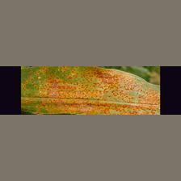
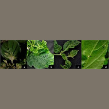
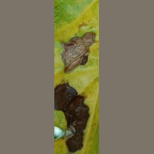
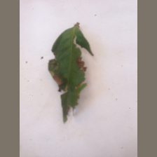
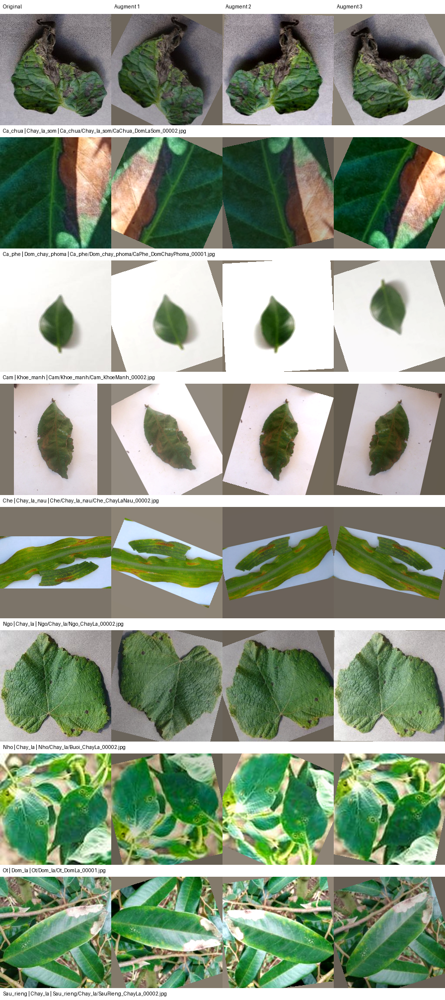

# Báo cáo resize dataset v1.2

Ngày hoàn thành: 2026-09-20

## Kết quả

- Nguồn chỉ đọc: `<dataset_root>/v1.1`.
- Đầu ra: `<dataset_root>/v1.2`.
- Tổng số ảnh: 75.025, tất cả 224×224.
- Phương pháp: giữ tỷ lệ theo cạnh dài nhất, căn giữa và pad màu RGB
  `(124, 116, 104)`; không crop và không stretch.
- 68.223 ảnh được resize, 2.365 ảnh được resize + pad và 4.437 ảnh 224×224
  được sao chép nguyên byte.

## Dẫn chứng xác minh

- Split giữ nguyên: train 52.517, validation 7.504, test 15.004.
- Giữ nguyên 42 lớp; hậu kiểm near-duplicate tạo 40.200 `group_id` cuối cùng.
- 75.025 đường dẫn và nhãn khớp hoàn toàn với v1.1. `group_id` và thành viên
  split được tính lại sau audit hậu-resize; tổng số ảnh mỗi split không đổi.
- Mỗi ảnh nguồn được đối chiếu SHA-256 trước khi xử lý.
- Mỗi ảnh đầu ra được mở lại, xác nhận 224×224 và tính SHA-256 mới.
- Đã kiểm tra lại độc lập toàn bộ 75.025 file: kích thước thật, dung lượng và
  SHA-256 đều khớp manifest.
- Đã khởi tạo DataLoader thực từ ba manifest: dataset có lần lượt
  52.517/7.504/15.004 record và sinh mapping đủ 42 lớp.
- Hình học của toàn bộ mapping hợp lệ: kích thước ảnh sau resize cộng padding
  luôn bằng 224×224, padding hai phía lệch tối đa một pixel.
- Sai lệch tỷ lệ lớn nhất do làm tròn pixel là 0,743%; không có phép kéo giãn
  độc lập theo hai chiều.
- Có 1.664 ảnh pad trái/phải và 701 ảnh pad trên/dưới.
- Không còn thư mục staging sau khi hoàn tất.

## Kiểm tra trực quan

Đã so sánh ảnh nguồn và ảnh v1.2 ở bốn trường hợp có tỷ lệ lớn nhất của từng
nhóm cây có ảnh không vuông:

| Mẫu | Kích thước nguồn | Nhận xét |
|---|---:|---|
| `Ngo/Gi_sat/Ngo_GhiSat_00311.jpg` | 1338×357 | Toàn bộ lá và đốm bệnh được giữ, pad trên/dưới. |
| `Ot/Ruoi_trang/Ot_BoPhanTrang_00080.jpg` | 432×116 | Giữ đủ bốn vùng ảnh, không crop, pad trên/dưới. |
| `Ca_phe/Sau_duc_la/CaPhe_SauDucLa_00613.jpg` | 74×256 | Giữ đủ vùng tổn thương, pad trái/phải. |
| `Che/Chay_la_nau/Che_ChayLaNau_00001.jpg` | 768×1024 | Giữ toàn bộ lá lệch tâm, pad trái/phải. |

Các mẫu cực đoan không bị cắt hoặc kéo méo. Đổi lại, vùng nội dung của ảnh rất
dài/hẹp bị thu nhỏ để giữ trọn khung hình; đây là đánh đổi có chủ đích.

### Preview ảnh sau resize

| Ngô — pad trên/dưới | Ớt — pad trên/dưới |
|---|---|
|  |  |

| Cà phê — pad trái/phải | Chè — pad trái/phải |
|---|---|
|  |  |

Vùng màu xám nâu là padding RGB `(124, 116, 104)`. Bốn preview là file v1.2
thật được sao chép nguyên byte vào tài liệu, không qua bước chỉnh sửa bổ sung.

### Contact sheet sau augmentation

Contact sheet dùng đúng `get_train_transforms()` trên tám loại cây, mỗi ảnh có
ba biến thể với seed cố định `20260920`. Lần kiểm tra đầu phát hiện rotation tạo
tam giác đen; pipeline đã được sửa sang nội suy bilinear và fill RGB
`(124, 116, 104)`. Lần kiểm tra thứ hai xác nhận màu, hình dạng lá và vùng bệnh
vẫn nhận biết được, không còn vùng đen giả tạo. Val/test không dùng augmentation
ngẫu nhiên.

## Leakage check sau resize

Lần kiểm tra đầu phát hiện 244 cặp group near-duplicate high-confidence trong
Hamming 0–5; 119 cặp nằm ở các split khác nhau. Tất cả đều cùng nhãn. Đã thực
hiện các bước sau:

- Gộp 367 group liên quan thành 144 component cùng nhãn.
- Chia lại 70/10/20 theo group với seed `20260919`, không di chuyển ảnh.
- Số group cuối: 40.200; split vẫn là 52.517/7.504/15.004 ảnh.
- Audit lại 127.025 lượt ứng viên Hamming 0–5: 0 cặp high-confidence còn nằm
  giữa các group khác nhau.
- Kiểm tra cuối: 0 đường dẫn, 0 `group_id`, 0 SHA-256 và 0 near-duplicate
  high-confidence xuyên split.
- 555 dHash còn xuất hiện ở nhiều split nhưng kiểm tra pixel không xác nhận cặp
  near-duplicate nào; đây là va chạm hash, không được xem là leakage.

Manifest trước regroup/resplit được lưu tại
`reports/step6_backup_before_post_resize_regroup`.

## Đối chiếu yêu cầu preprocessing và augmentation

| Yêu cầu | Trạng thái | Dẫn chứng |
|---|---|---|
| Ảnh đầu vào 224×224, không stretch | Đạt | 75.025/75.025 ảnh có kích thước thật 224×224; tỷ lệ được giữ trong sai số làm tròn pixel. |
| Resize cạnh ngắn + `CenterCrop(224)` | Khác kỹ thuật | v1.2 dùng resize cạnh dài + pad để không cắt nội dung lệch tâm. Nếu bắt buộc đúng công thức trong ảnh thì mục này chưa đạt. |
| Normalize ImageNet | Đạt trong DataLoader | `augmentations.py` dùng đúng mean `[0.485, 0.456, 0.406]` và std `[0.229, 0.224, 0.225]`; không ghi normalize trực tiếp vào file JPEG. |
| Flip ngang/dọc và rotate | Đạt | Train transform có flip ngang/dọc và `RandomRotation(30)`; rotation dùng bilinear và màu fill khớp padding. |
| `RandomResizedCrop(scale=(0.75, 1.0))` | Không áp dụng có chủ đích | Ảnh có vùng bệnh lệch tâm; random crop có thể làm mất tín hiệu. Quyết định dùng flip, rotate và ColorJitter đã được kiểm tra trực quan. |
| ColorJitter vừa phải | Đạt | Brightness/contrast/saturation là `0.2`, hue tắt. |
| Mixup/CutMix, RandomErasing | Chưa áp dụng | Đây là mục cân nhắc, không phải điều kiện bắt buộc. |
| Không dùng RandomGrayscale | Đạt | Pipeline không có `RandomGrayscale`. |
| Val/test chỉ resize + normalize | Đạt | Ảnh v1.2 đã là 224×224 nên resize là no-op; không có augmentation ngẫu nhiên. |
| Kiểm tra trực quan sau augmentation | Đạt | Contact sheet gồm tám loại cây × ba biến thể; đã sửa artifact màu đen và kiểm tra lại thành công. |

## Kết luận theo yêu cầu

Dataset v1.2 **đạt mục tiêu kích thước 224×224, giữ tỷ lệ và không làm mất nội
dung lệch tâm**, nhưng **không dùng đúng `CenterCrop` như công thức trong ảnh**.
Đây là thay đổi có chủ đích vì CenterCrop có thể cắt mất vùng bệnh sát mép.
`RandomResizedCrop` được loại khỏi pipeline có chủ đích vì không phù hợp ảnh có
vùng bệnh lệch tâm. Contact sheet của pipeline được chọn đã đạt kiểm tra trực
quan; leakage check hậu-resize cũng đã đạt.

## Definition of Done

- [x] 75.025 ảnh có kích thước thật 224×224, checksum khớp manifest.
- [x] Không crop hoặc stretch ảnh nguồn; đã kiểm tra các tỷ lệ cực đoan.
- [x] Contact sheet sau augmentation đã được xem và đạt yêu cầu.
- [x] Train/validation/test đều có đủ 42 lớp.
- [x] Không có đường dẫn, `group_id`, SHA-256 hoặc near-duplicate
  high-confidence xuyên split.
- [x] DataLoader đọc trực tiếp ba manifest cuối của v1.2.
- [x] Toàn bộ 18 unit test chạy thành công.
- [x] Dataset v1.1 không bị sửa hoặc xóa file.

**Trạng thái DoD: HOÀN THÀNH.**

## Artifact

- Manifest: `<dataset_root>/v1.2/manifests/dataset_manifest.csv`.
- Ba split: `<dataset_root>/v1.2/manifests/train.csv`, `val.csv`,
  `test.csv`.
- Metadata: `<dataset_root>/v1.2/metadata/dataset_version.json`.
- Mapping resize: `<dataset_root>/v1.2/reports/resize_mapping.csv`.
- Kết quả leakage cuối: `<dataset_root>/v1.2/reports/post_resize_leakage_summary.json`.
- Audit Hamming hậu-resize: `<dataset_root>/v1.2/reports/post_resize_hamming_0_to_5_summary.json`.
- Mapping regroup: `<dataset_root>/v1.2/reports/post_resize_group_merge_mapping.csv`.
- Mã xử lý: `ai/scripts/dataset/build_resized_dataset.py`.
- Transform runtime: `ai/data/augmentations.py`.

DataLoader mặc định đã được chuyển sang v1.2. Dataset v1.1 không bị sửa hoặc
xóa file.
