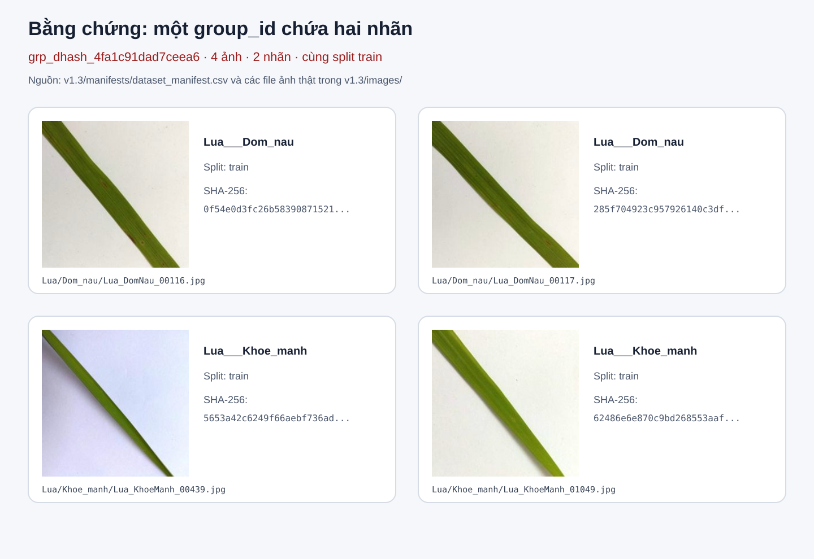
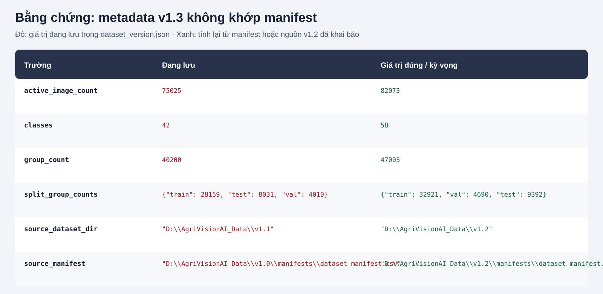
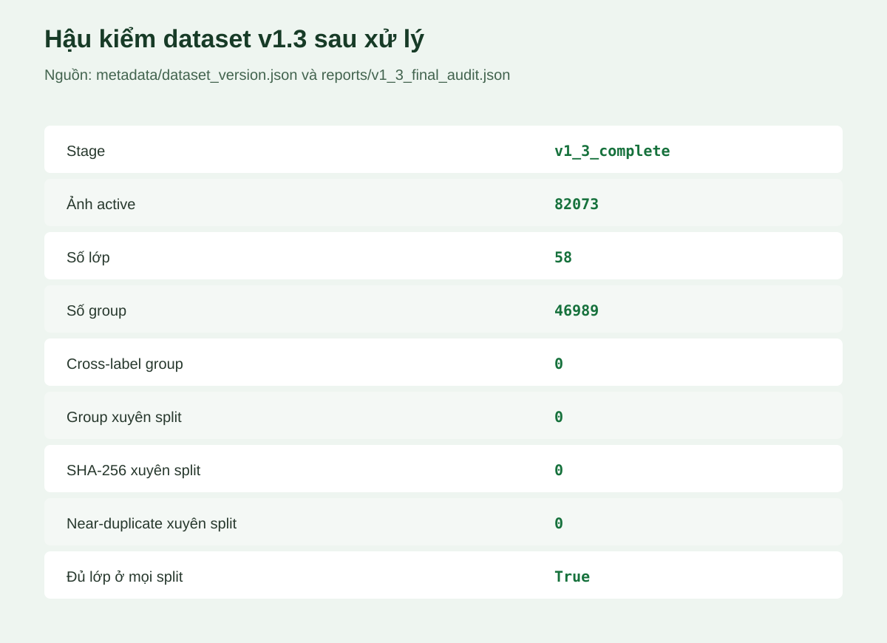
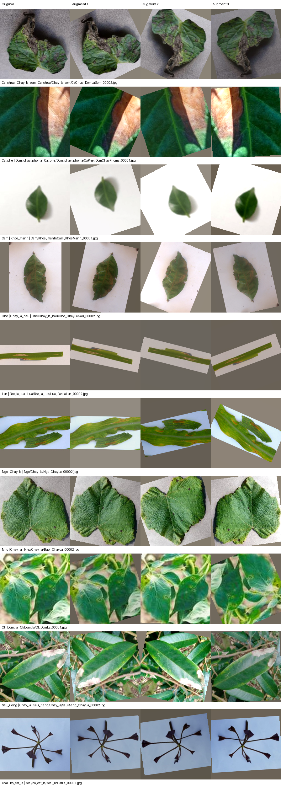

# Review và xử lý các điểm chưa đạt của dataset v1.3

- Ngày review: 2026-09-22
- Dataset được kiểm tra: `D:\AgriVisionAI_Data\v1.3`
- Phiên bản đối chiếu: `D:\AgriVisionAI_Data\v1.2`
- Phạm vi: review, xử lý group sai và đồng bộ metadata; không xóa hoặc di chuyển ảnh.
- Trạng thái xử lý: hoàn tất ngày 2026-09-22; có backup trước khi cập nhật.

## Kết luận

Lần review ban đầu phát hiện một `group_id` chứa ảnh thuộc hai nhãn khác nhau và metadata
chưa phản ánh đúng manifest v1.3. Hai vấn đề đã được xử lý: group được xác nhận là va chạm
dHash, sau đó tách thành bốn group singleton theo SHA-256; metadata được tính lại từ manifest.
Hậu kiểm cuối đạt 0 cross-label group, 0 path, `group_id`, SHA-256 và near-duplicate
high-confidence xuyên split.

## 1. Cross-label group phát hiện trước xử lý

Trước xử lý, manifest v1.3 có đúng một group chứa nhiều hơn một `compound_label`:

| Thuộc tính | Giá trị |
|---|---|
| `group_id` | `grp_dhash_4fa1c91dad7ceea6` |
| Split | `train` |
| Số ảnh | 4 |
| Số nhãn | 2 |
| Nhãn 1 | `Lua___Dom_nau` — 2 ảnh |
| Nhãn 2 | `Lua___Khoe_manh` — 2 ảnh |

Các file liên quan:

- `Lua/Dom_nau/Lua_DomNau_00116.jpg`
- `Lua/Dom_nau/Lua_DomNau_00117.jpg`
- `Lua/Khoe_manh/Lua_KhoeManh_00439.jpg`
- `Lua/Khoe_manh/Lua_KhoeManh_01049.jpg`



### Vì sao chưa đạt

Pipeline v1.2 yêu cầu mỗi `group_id` chỉ thuộc một nhãn để các ảnh giống hoặc gần giống nhau
không cung cấp tín hiệu nhãn mâu thuẫn cho mô hình. v1.3 vẫn giữ được toàn bộ group trong một
split nên chưa gây leakage train/val/test, nhưng group này không còn thuần nhất về nhãn và chưa
thể xem là đã hoàn tất bước review near-duplicate.

### Điều kiện để đóng lỗi

- Review trực quan và nghiệp vụ bốn ảnh để xác định đây là nhãn sai hay trường hợp không thể kết luận.
- Nếu không thể xác nhận nhãn, quarantine toàn bộ group theo cách có thể khôi phục như v1.2.
- Sau xử lý, audit phải trả về `cross_label_group_count = 0`.
- Chạy lại kiểm tra leakage và xác nhận mỗi group chỉ xuất hiện trong một split.

### Kết quả xử lý

Kiểm tra trực quan và đối chiếu pixel grayscale xác nhận bốn ảnh không phải near-duplicate.
Mọi cặp khác nhãn đều không đạt ngưỡng tương đồng: correlation cao nhất `0,963450`, nhỏ hơn
`0,9999`; normalized MAE thấp nhất `0,066987`, lớn hơn `0,005`. Vì vậy không quarantine ảnh.
Group cũ được tách thành bốn singleton `sha256:<digest>`, đồng thời giữ nguyên toàn bộ ảnh,
nhãn và split `train`.

## 2. Metadata v1.3 trước khi đồng bộ

Trước xử lý, một số trường trong `metadata/dataset_version.json` vẫn là số liệu hoặc đường dẫn
của phiên bản cũ, trong khi các trường `total_*` ở cuối file đã ghi nhận đúng quy mô v1.3.

| Trường | Trước xử lý | Sau xử lý |
|---|---:|---:|
| `active_image_count` | 75.025 | 82.073 |
| `classes` | 42 | 58 |
| `group_count` | 40.200 | 46.989 |
| `split_group_counts.train` | 28.159 | 32.911 |
| `split_group_counts.val` | 4.010 | 4.689 |
| `split_group_counts.test` | 8.031 | 9.389 |
| `source_dataset_dir` | trỏ đến `v1.1` | trỏ đến `v1.2` |
| `source_manifest` | trỏ đến manifest `v1.0` | trỏ đến manifest `v1.2` |



### Vì sao chưa đạt

Metadata hiện đưa ra hai trạng thái mâu thuẫn trong cùng một file: các trường kế thừa mô tả
75.025 ảnh, 42 lớp và 40.200 group, còn các trường mở rộng mô tả đúng 82.073 ảnh, 58 lớp và
10 loại cây. Công cụ hoặc thành viên đọc nhóm trường cũ có thể cấu hình sai số lớp, đánh giá sai
quy mô dataset hoặc truy vết sai nguồn dữ liệu.

### Điều kiện để đóng lỗi

- Cập nhật các trường đếm từ chính manifest v1.3 thay vì giữ số liệu v1.2.
- Đồng bộ `source_dataset_dir` và `source_manifest` với `source_dataset_version = v1.2`.
- Chạy audit metadata và xác nhận không còn trường đếm hoặc đường dẫn nguồn mâu thuẫn.

Tất cả điều kiện trên đã đạt. Tổng phép resize cũng đã được đồng bộ thành 71.860
`resize_only`, 5.772 `resize_and_pad` và 4.441 `copy_same_size`, tổng cộng 82.073 ảnh.

## Hậu kiểm sau xử lý



- Manifest chính và hợp ba manifest split khớp đủ 82.073 dòng.
- Train/val/test giữ nguyên 57.449/8.209/16.415 ảnh và đều có đủ 58 lớp.
- Tổng số group mới là 46.989; không còn group cũ `grp_dhash_4fa1c91dad7ceea6`.
- Cross-label group: 0; path, `group_id` và SHA-256 xuyên split: 0.
- Không xóa, di chuyển hoặc quarantine ảnh nào.

## Xử lý near-duplicate leakage Hamming 0–5

Full audit lần hai phát hiện 17 cặp high-confidence thuộc cùng nhãn, trong đó 8 cặp
`Xoai___bo_cat_la` nằm ở các split khác nhau. Pipeline đã merge 34 group cũ thành 17
component, sau đó chỉ đổi split của 8 ảnh để mỗi component nằm trọn trong một split.

- Không xóa, di chuyển file vật lý hoặc quarantine ảnh.
- Tổng ảnh mỗi split giữ nguyên 57.449/8.209/16.415.
- `Xoai___bo_cat_la` giữ nguyên 350/50/100 ảnh.
- Hậu kiểm 155.950 ứng viên Hamming 0–5: 0 cặp high-confidence còn nằm giữa các group.
- Exact dHash hậu kiểm: 0 cặp high-confidence xuyên split.

## Kiểm tra augmentation v1.3



- 7.048 ảnh lúa/xoài mở thành công, đều là JPEG 224×224.
- Kiểm tra 64 output trên 16 lớp mới: đúng tensor 3×224×224, không có NaN/Inf.
- Validation transform xác định và không có augmentation ngẫu nhiên.
- Train rotation dùng bilinear và fill `(124, 116, 104)`; contact sheet không có vùng đen giả.
- Toàn bộ 28 unit test AGRI-21 pass.

## Bằng chứng và cách tái lập

- Manifest: `D:\AgriVisionAI_Data\v1.3\manifests\dataset_manifest.csv`.
- Metadata: `D:\AgriVisionAI_Data\v1.3\metadata\dataset_version.json`.
- Leakage report hiện tại: `D:\AgriVisionAI_Data\v1.3\reports\split_leakage_check.csv`.
- Báo cáo quyết định: `D:\AgriVisionAI_Data\v1.3\reports\cross_label_group_resolution.csv`.
- Hậu kiểm cuối: `D:\AgriVisionAI_Data\v1.3\reports\v1_3_final_audit.json`.
- Full Hamming audit: `D:\AgriVisionAI_Data\v1.3\reports\post_resize_hamming_0_to_5_summary.json`.
- Mapping merge group: `D:\AgriVisionAI_Data\v1.3\reports\v1_3_near_duplicate_group_merge_mapping.csv`.
- Log 8 ảnh đổi split: `D:\AgriVisionAI_Data\v1.3\reports\v1_3_split_move_log.csv`.
- Backup trước xử lý: `D:\AgriVisionAI_Data\v1.3\reports\step_v1_3_backup_before_cross_label_resolution`.
- Backup trước regroup: `D:\AgriVisionAI_Data\v1.3\reports\step_v1_3_backup_before_near_duplicate_regroup`.
- Script sinh ảnh: `ai/tasks/agri_21/scripts/generate_v1_3_gap_evidence.py`.
- Script xử lý: `ai/tasks/agri_21/scripts/finalize_v1_3_dataset.py`.

Chạy lại ảnh bằng chứng từ root repository:

```powershell
python -X utf8 -m ai.tasks.agri_21.scripts.generate_v1_3_gap_evidence `
  --dataset-dir "D:\AgriVisionAI_Data\v1.3" `
  --output-dir "docs\reports\AGRI-21\assets\dataset_v1_3_gap_review"
```

## Hậu kiểm toàn diện lần cuối

Lần hậu kiểm độc lập ngày 2026-09-22 đã đọc lại toàn bộ manifest và toàn bộ file ảnh, thay vì
chỉ dựa trên các báo cáo đã sinh trước đó.

| Hạng mục | Kết quả |
|---|---|
| File ảnh so với manifest | 82.073/82.073 tồn tại; 0 file thừa, 0 file thiếu |
| Toàn vẹn file | 0 sai dung lượng, 0 sai SHA-256, 0 lỗi giải mã |
| Chuẩn ảnh | 82.073 JPEG đều đúng 224×224 |
| Cấu trúc manifest | 0 path trùng; 0 path sai cây/bệnh; 0 field ngữ nghĩa sai |
| Group | 46.989 group; 0 group đa nhãn; 0 group xuyên split |
| Exact duplicate | 1.334 SHA-256 lặp, gồm 3.733 dòng; 0 SHA-256 đa nhãn/đa group/xuyên split |
| Split | 57.449/8.209/16.415; ba split đều đủ 58 lớp |
| Kế thừa v1.2 | 75.025/75.025 dòng còn đủ và không đổi field |
| Loader thật | Đọc đủ ba split, nhận 58 lớp, 10 cây và có cả Lúa/Xoài |
| Unit test | 28/28 pass |
| Runtime smoke test | Import train/evaluate/predict đạt; ConvNeXt-Tiny forward trả tensor `(1, 58)` hữu hạn |
| Hamming 0–5 | 155.950 ứng viên; 0 cặp high-confidence khác group hoặc xuyên split |

`phash_cross_split_count = 583` trong báo cáo leakage là số va chạm dHash thô, không phải 583
leakage đã xác nhận. Sau khi đối chiếu pixel với correlation tối thiểu `0,9999` và normalized MAE
tối đa `0,005`, số cặp high-confidence xuyên split là 0; hai CSV review chỉ còn dòng header.

### Các điểm tích hợp đã xử lý

1. `ai/class_to_idx.json` đã được sinh lại từ ba manifest v1.3 và có đủ 58 lớp, gồm Lúa/Xoài.
   Inference và evaluation giờ bắt buộc dùng `idx_to_info` đi kèm checkpoint, kiểm tra đủ index
   `0..num_classes-1`; evaluation còn đối chiếu mapping checkpoint với manifest hiện tại. Các
   checkpoint thiếu/sai mapping hoặc khác phiên bản dataset đều bị từ chối; không còn fallback
   nguy hiểm sang JSON của phiên bản khác.
2. `README.md`, `docs/README.md` và task log AGRI-21 đã chuyển dataset training mặc định sang
   v1.3, ghi đúng cấu trúc, quy mô, lệnh test và đường dẫn cấu hình.
3. Toàn bộ field `post_resize_*` lịch sử đã được chuyển vào
   `source_v1_2_pipeline_audit`. Audit v1.3 hiện ghi riêng 155.950 ứng viên Hamming, 583 va chạm
   dHash thô và 0 cặp high-confidence; metadata cũ được backup trước release-sync.
4. Resolver v1.3 đã có test cho merge component, từ chối cross-label, namespace metadata và
   rollback giao dịch. Test mô phỏng lỗi ở lần replace thứ hai xác nhận các file đã thay trước đó
   được khôi phục.
5. Giới hạn lớp ít mẫu được giữ minh bạch thay vì nhân bản dữ liệu để làm đẹp thống kê:
   `Lua___Dom_than_la` có 40 ảnh (28/4/8) và `Ca_phe___Khoe_manh` có 62 ảnh (46/6/10).
   Evaluation tiếp tục báo cáo macro-F1, classification report, confusion matrix và giờ cảnh báo
   rõ mọi lớp có test support dưới 20.

## Trạng thái review

**ĐÃ ĐẠT** — dữ liệu và tích hợp repository v1.3 đạt các kiểm tra về file, nhãn, group, split,
exact leakage, near-duplicate leakage, augmentation, mapping checkpoint, metadata và tài liệu.
Dataset có thể dùng làm bản chính thức cho thí nghiệm; khi báo cáo kết quả vẫn phải nêu cỡ mẫu
của các lớp nhỏ và ưu tiên macro-F1 cùng confusion matrix.
