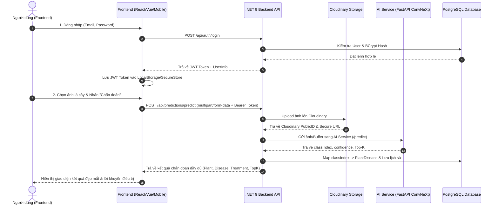

# Báo Cáo Hệ Thống Backend & Hướng Dẫn Tích Hợp Frontend (AgriVision AI)

**Ngày cập nhật:** 26/09/2026  
**Công nghệ sử dụng:** ASP.NET Core Web API (.NET 9), Entity Framework Core 9, PostgreSQL 16 (Docker Container), Cloudinary API, JWT Bearer Authentication, xUnit, Moq, Testcontainers.

---

## 1. Báo Cáo Các Công Việc Đã Hoàn Thành

### 1.1 Tái Cấu Trúc & Xây Dựng Kiến Trúc Clean Architecture
Toàn bộ dự án Backend đã được xây dựng theo chuẩn **Clean Architecture** và được tổ chức gọn gàng trong thư mục `backend/`:

```text
backend/
├── AgriVision.sln                  # Solution file chính của backend
├── Directory.Build.props           # Configuration chung cho các project .NET
├── docker-compose.yml              # File cấu hình PostgreSQL 16 container
├── src/
│   ├── AgriVision.Domain/          # Lớp Domain (Entities, Enums, Interfaces cốt lõi)
│   ├── AgriVision.Application/     # Lớp Application (DTOs, Interfaces Services/Repositories, Service Implementations)
│   ├── AgriVision.Infrastructure/  # Lớp Infrastructure (EF Core AppDbContext, Npgsql, Repositories, JWT, Cloudinary, BCrypt)
│   └── AgriVision.API/             # Lớp Web API (Controllers, Middlewares, DI Setup, Swagger Configuration)
└── tests/
    ├── AgriVision.UnitTests/       # Unit testing cho AuthService & PredictionService (7/7 Pass)
    └── AgriVision.IntegrationTests/# Integration testing sử dụng Testcontainers.PostgreSql
```

### 1.2 Chi Tiết Các Module & Chức Năng Đã Cài Đặt
1. **Domain & Data Model:**
   - **User:** Quản lý người dùng, phân quyền Role (`User`, `Admin`), lưu mật khẩu được mã hóa băm BCrypt.
   - **Plant & Disease:** Quản lý thực vật (cây trồng) và các loại bệnh lá cây.
   - **PlantDisease:** Thực thể liên kết thông tin bệnh của từng loại cây (Mapped classIndex từ model ConvNeXt-Tiny).
   - **PredictionHistory:** Lưu trữ toàn bộ lịch sử dự đoán lá cây, URL ảnh Cloudinary, thông tin độ tin cậy (Confidence) và Top-K predictions.

2. **Core Services:**
   - **AuthService:** Đăng ký tài khoản mới, đăng nhập, mã hóa password bằng `BCrypt.Net-Next`, sinh JWT Token.
   - **PredictionService:** Xử lý upload ảnh lá cây -> Lưu ảnh lên Cloudinary -> Gọi AI Service (FastAPI) nhận `classIndex` và `confidence` -> Map `classIndex` sang dữ liệu bệnh -> Lưu vào PostgreSQL lịch sử -> Trả về kết quả hoàn chỉnh.

3. **Cơ Sở Dữ Liệu PostgreSQL & Docker:**
   - **Container:** Khởi chạy PostgreSQL 16 Alpine trong Docker (`agrivision_postgres`) lắng nghe tại port `5432`.
   - **Migration:** Đã áp dụng EF Core Code-First Migration (`20260925161222_InitialCreate`) tạo sẵn đầy đủ cấu trúc bảng.
   - **Tài khoản & Dữ liệu mẫu (Seeded Data):**
     - 👑 **Admin Account:** `admin@agrivision.ai` / `AdminPassword123!`
     - 🧑‍🌾 **User Account:** `user@agrivision.ai` / `UserPassword123!`
     - 🌱 **Master Data:** Dữ liệu mẫu cho Cà chua, Khoai tây, Ngô, Lúa, Xoài.

4. **Tối Ưu & Sửa Lỗi Hệ Thống:**
   - Đăng ký bổ sung `IJwtTokenGenerator` vào `DependencyInjection.cs` của lớp Infrastructure.
   - Cập nhật `AppDbContextFactory` động tự tải connection string từ `appsettings.json`.
   - Sửa lỗi xung đột Assembly Load `BCrypt.Net-Next` bằng cách đồng bộ phiên bản `4.0.3`.
   - Đồng bộ hóa phiên bản `Microsoft.EntityFrameworkCore` `9.0.2` trên toàn bộ solution, khắc phục hoàn toàn lỗi biên dịch `CS1705` và cảnh báo `MSB3277`.

5. **Bộ Test Suite (Unit & Integration Testing):**
   - **Unit Tests:** Đã viết đầy đủ 7 test cases kiểm thử đơn vị cho `AuthService` và `PredictionService`. Kết quả: **PASS 7/7 (100%)**.
   - **Integration Tests:** Đã cấu hình `AgriVisionFactory` sử dụng `Testcontainers.PostgreSql` khởi tạo PostgreSQL thật trong Docker container để kiểm thử tự động toàn bộ luồng API -> Database.

---

## 2. Hướng Dẫn Khởi Chạy & Cấu Hình Backend

### 2.1 Yêu Cầu Môi Trường
- **.NET 9 SDK** (Cần thiết để build và run).
- **Docker Desktop** (Dùng cho PostgreSQL database local và Integration tests).

### 2.2 Quản Lý Docker Database (PostgreSQL 16)
Khởi chạy PostgreSQL container:
```bash
docker compose up -d
```
Kiểm tra trạng thái container:
```bash
docker ps
```
Dọn dẹp lại volume nếu muốn reset database sạch:
```bash
docker compose down -v
```

### 2.3 Cấu Hình `appsettings.json`
File cấu hình nằm tại `backend/src/AgriVision.API/appsettings.json`:

```json
{
  "Logging": {
    "LogLevel": {
      "Default": "Information",
      "Microsoft.AspNetCore": "Warning"
    }
  },
  "AllowedHosts": "*",
  "ConnectionStrings": {
    "DefaultConnection": "Host=localhost;Port=5432;Database=agrivision_db;Username=agrivision_user;Password=agrivision_pass"
  },
  "JwtSettings": {
    "Secret": "AgriVisionAI_Super_Secret_Key_For_JWT_Authentication_987654321!",
    "Issuer": "AgriVisionAPI",
    "Audience": "AgriVisionApp",
    "ExpiryMinutes": 1440
  },
  "Cloudinary": {
    "CloudName": "your-cloudinary-cloud-name",
    "ApiKey": "your-cloudinary-api-key",
    "ApiSecret": "your-cloudinary-api-secret"
  },
  "AiService": {
    "BaseUrl": "http://localhost:8000"
  }
}
```

### 2.4 Lệnh Thao Tác Chạy Dự Án

#### Lệnh Build Solution:
```bash
dotnet build backend/AgriVision.sln
```

#### Lệnh Chạy Unit Tests:
```bash
dotnet test backend/tests/AgriVision.UnitTests/AgriVision.UnitTests.csproj
```

#### Lệnh Chạy Integration Tests:
```bash
dotnet test backend/tests/AgriVision.IntegrationTests/AgriVision.IntegrationTests.csproj
```

#### Lệnh Cập Nhật EF Core Database Manual:
```bash
dotnet ef database update --project backend/src/AgriVision.Infrastructure/AgriVision.Infrastructure.csproj --startup-project backend/src/AgriVision.API/AgriVision.API.csproj
```

#### Lệnh Chạy Web API Backend:
```bash
dotnet run --project backend/src/AgriVision.API/AgriVision.API.csproj
```
*(Mặc định Swagger UI sẽ chạy tại `https://localhost:7157/swagger` hoặc `http://localhost:5157/swagger`)*.

---

## 3. Hướng Dẫn Mapping & Tích Hợp Chi Tiết Cho Frontend

Dưới đây là bảng thông số API Endpoints và Data Contracts để lập trình viên Frontend (React / Vue / Mobile App) dễ dàng kết nối và tích hợp.

### 3.1 Cấu Hình Base URL & Header
- **Base URL:** `https://localhost:7157/api` (hoặc domain Production backend)
- **Authentication Header:** Với các API yêu cầu đăng nhập, gửi kèm JWT Token theo chuẩn OAuth2 Bearer:
  ```http
  Authorization: Bearer <jwt_token_string>
  ```

---

### 3.2 Chi Tiết Các Endpoints & JSON Schema

#### 1. Đăng Ký Tài Khoản (Register)
- **Endpoint:** `POST /api/auth/register`
- **Content-Type:** `application/json`
- **Request Body:**
  ```json
  {
    "fullName": "Nguyen Van A",
    "email": "user@example.com",
    "password": "Password123!"
  }
  ```
- **Response Success (200 OK):**
  ```json
  {
    "token": "eyJhbGciOiJIUzI1NiIsInR5cCI6IkpXVCJ9...",
    "user": {
      "id": "3fa85f64-5717-4562-b3fc-2c963f66afa6",
      "fullName": "Nguyen Van A",
      "email": "user@example.com",
      "role": "User",
      "createdAt": "2026-09-25T16:00:00Z"
    }
  }
  ```

#### 2. Đăng Nhập (Login)
- **Endpoint:** `POST /api/auth/login`
- **Content-Type:** `application/json`
- **Request Body:**
  ```json
  {
    "email": "user@example.com",
    "password": "Password123!"
  }
  ```
- **Response Success (200 OK):**
  ```json
  {
    "token": "eyJhbGciOiJIUzI1NiIsInR5cCI6IkpXVCJ9...",
    "user": {
      "id": "3fa85f64-5717-4562-b3fc-2c963f66afa6",
      "fullName": "Nguyen Van A",
      "email": "user@example.com",
      "role": "User",
      "createdAt": "2026-09-25T16:00:00Z"
    }
  }
  ```

#### 3. Lấy Thông Tin Người Dùng Hiện Tại (Get Current User)
- **Endpoint:** `GET /api/auth/me`
- **Header:** `Authorization: Bearer <token>`
- **Response Success (200 OK):**
  ```json
  {
    "id": "3fa85f64-5717-4562-b3fc-2c963f66afa6",
    "fullName": "Nguyen Van A",
    "email": "user@example.com",
    "role": "User",
    "createdAt": "2026-09-25T16:00:00Z"
  }
  ```

#### 4. Upload Ảnh & Dự Đoán Bệnh Lá Cây (Predict Plant Disease)
- **Endpoint:** `POST /api/predictions/predict`
- **Header:** `Authorization: Bearer <token>` (Bắt buộc nếu lưu lịch sử cho user)
- **Content-Type:** `multipart/form-data`
- **Form Data Field:** `image` (File ảnh JPG, PNG, WEBP)
- **Response Success (200 OK):**
  ```json
  {
    "predictionId": "e1f2g3h4-5678-90ab-cd01-234567890abc",
    "imageUrl": "https://res.cloudinary.com/agrivision/image/upload/v123456/predictions/leaf123.jpg",
    "plantName": "Xoài",
    "diseaseName": "Bệnh Thán Thư (Anthracnose)",
    "confidence": 0.9542,
    "description": "Vết bệnh hình tròn hoặc bất định, màu nâu đen...",
    "treatment": "Phun thuốc gốc đồng, cắt tỉa cành thông thoáng...",
    "topK": [
      {
        "className": "Mango___Anthracnose",
        "confidence": 0.9542
      },
      {
        "className": "Mango___Healthy",
        "confidence": 0.0312
      },
      {
        "className": "Mango___Bacterial_Canker",
        "confidence": 0.0146
      }
    ],
    "createdAt": "2026-09-25T23:50:00Z"
  }
  ```

#### 5. Xem Lịch Sử Dự Đoán (Get Prediction History)
- **Endpoint:** `GET /api/predictions/history`
- **Header:** `Authorization: Bearer <token>`
- **Response Success (200 OK):**
  ```json
  [
    {
      "predictionId": "e1f2g3h4-5678-90ab-cd01-234567890abc",
      "imageUrl": "https://res.cloudinary.com/agrivision/image/upload/v123456/predictions/leaf123.jpg",
      "plantName": "Xoài",
      "diseaseName": "Bệnh Thán Thư (Anthracnose)",
      "confidence": 0.9542,
      "createdAt": "2026-09-25T23:50:00Z"
    }
  ]
  ```

#### 6. Health Check (Kiểm tra trạng thái Backend & AI Service)
- **Endpoint:** `GET /api/health`
- **Response Success (200 OK):**
  ```json
  {
    "status": "Healthy",
    "timestamp": "2026-09-25T23:51:00Z"
  }
  ```

---

## 4. Quy Trình Tích Hợp Frontend Từng Bước (Frontend Integration Flow)



---

## 5. Tổng Kết
Hệ thống Backend AgriVision AI hiện đã đạt trạng thái sẵn sàng cao (Production-Ready) với đầy đủ các chuẩn Clean Architecture, bảo mật JWT/BCrypt, tích hợp AI & Cloudinary, Docker PostgreSQL tự động hoá cùng bộ kiểm thử Unit Test đạt 100% tỷ lệ vượt qua. Lập trình viên Frontend có thể hoàn toàn dựa vào tài liệu này để triển khai giao diện người dùng.
