# AGRI-76 — Tổng hợp sơ đồ AgriVision AI từ BFD đến ERD

36 sơ đồ chính, 10 mục tiêu Use Case. Cập nhật 07/10/2026 theo source/schema sau AGRI-70.
28 mô hình hiện tại + 1 ERD baseline lịch sử + 7 mô hình mục tiêu. ERD 6 bảng giữ nguyên;
ERD mới có 9 bảng. Prefix target_ là đề xuất, không bằng chứng inference thật hoặc toàn bộ User Story hoàn tất.

Nguồn: [System Analysis](system_analysis.md), [Use Case Specification](use_case_specifications.md),
[traceability](traceability.md), [DB verification](database_verification.md), [mục tiêu](core_target_workflows.md).
[Gallery offline](diagrams/index.html), [nguồn sơ đồ/giải thích](diagrams/README.md), [verification](verification.md).

## 1. BFD — Phân rã chức năng

### bfd — HIỆN TẠI

F0 → F1–F5 → chức năng source hiện tại; UC-01–10. Tree phân rã, không là thứ tự thời gian. User persist sau AI/mapping; GET detail cần owner. F5.3/F5.4 là migration/expiry chạy riêng, chưa scheduler.

[Source editable](diagrams/bfd.puml) · [SVG đầy đủ](diagrams/bfd.svg)

## 2. DFD — Luồng dữ liệu

### dfd_context — HIỆN TẠI

Boundary web/API/DB/local/browser session; Cloudinary/HTTP AI bên ngoài. Khách API POST/catalog, không GET detail tài khoản. Ops health/migrate/expiry; payload vào/ra cân bằng Level 1.

[Source editable](diagrams/dfd_context.puml) · [SVG đầy đủ](diagrams/dfd_context.svg)

### dfd_level_1 — HIỆN TẠI

P1–P8; D1 users, D2 predictions/details/images/snapshot, D3 catalog, D4 browser session, D5 local images, D6 EF history/schema. P3 ↔ D3 có catalog Includes/legacy fallback DTO. P2 khách không ghi D2/storage; cleanup persistence có phản hồi storage. P8 là lệnh riêng, Development seed có điều kiện.

[Source editable](diagrams/dfd_level_1.puml) · [SVG đầy đủ](diagrams/dfd_level_1.svg)

### dfd_level_2_auth — HIỆN TẠI

P1.1–P1.5: register/login/ký token/restore/profile UI/logout. Không có refresh-token table hoặc profile-update API. Nguồn: AuthController/AuthService, JwtTokenGenerator, authApi, ProfilePage/App.

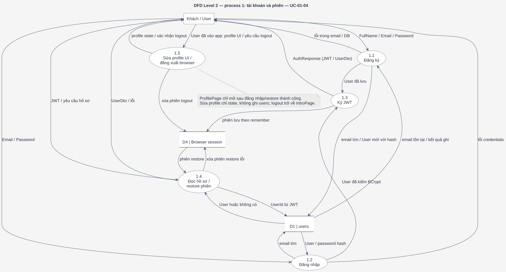

[Source editable](diagrams/dfd_level_2_auth.puml) · [SVG đầy đủ](diagrams/dfd_level_2_auth.svg)

### dfd_level_2_prediction — HIỆN TẠI

Phân rã P2; AI/strict mapping trước storage. Khách qua P2.7 trả DTO không persistence, User qua P2.3/P2.6 lưu image/snapshot. Cleanup ID/lỗi DB và phản hồi storage được cân bằng với Level 1. Không thêm FastAPI/model nội bộ chưa tồn tại.

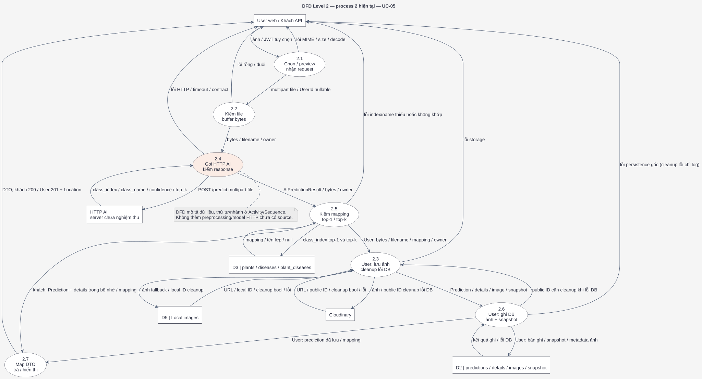

[Source editable](diagrams/dfd_level_2_prediction.puml) · [SVG đầy đủ](diagrams/dfd_level_2_prediction.svg)

## 3. Use Case — Tác nhân và chức năng

### use_cases — HIỆN TẠI

Đúng 10 mục tiêu nghiệp vụ. Khách association UC-05/UC-08; không association UC-06. User detail/history đúng owner; Admin CRUD catalog/xóa khác owner nhưng không đọc detail khác owner. UC-10 gồm health và lệnh vận hành. Không thêm include/extend cho bước xử lý nội bộ.

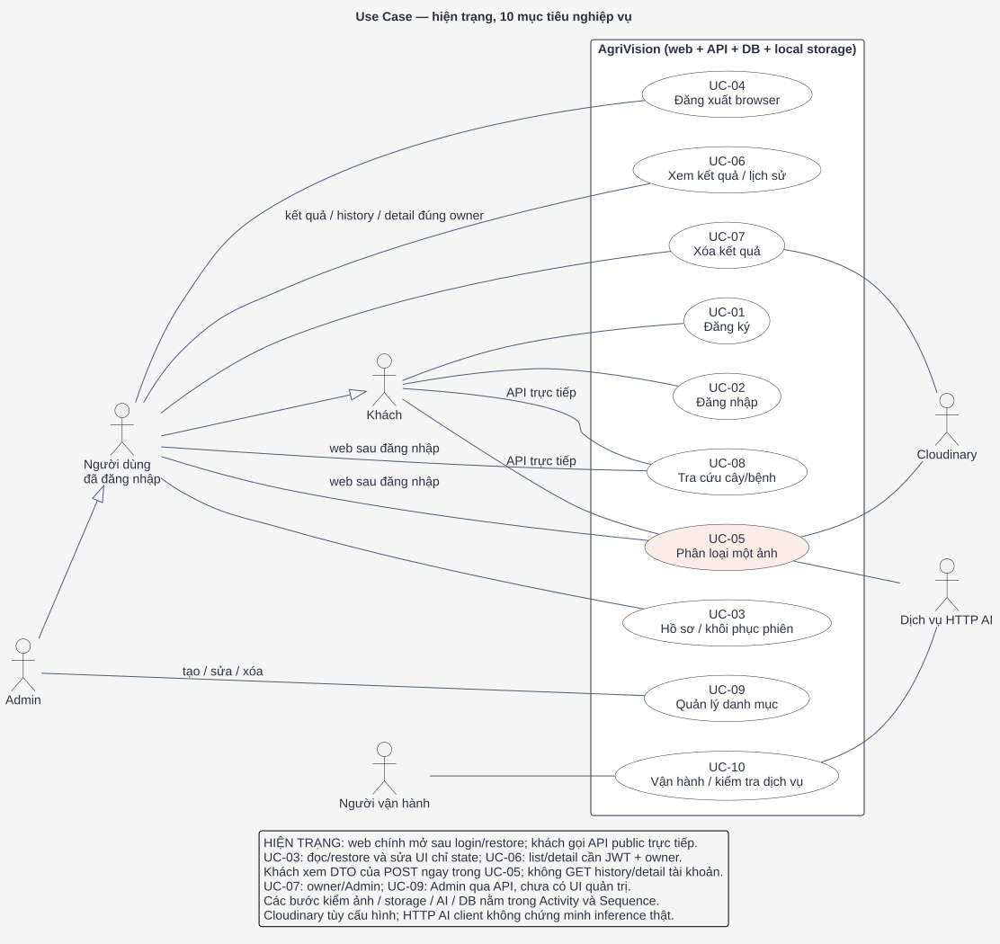

[Source editable](diagrams/use_cases.puml) · [SVG đầy đủ](diagrams/use_cases.svg)

## 4. Activity — Quy trình hoạt động

### activity_ai_cli — HIỆN TẠI

Khởi tạo predictor và chạy inference Python riêng: checkpoint/RGB/transform/model/softmax/topk. Không ghép thành workflow HTTP. Nguồn: ai/predict.py, convnext.py, augmentations.py.

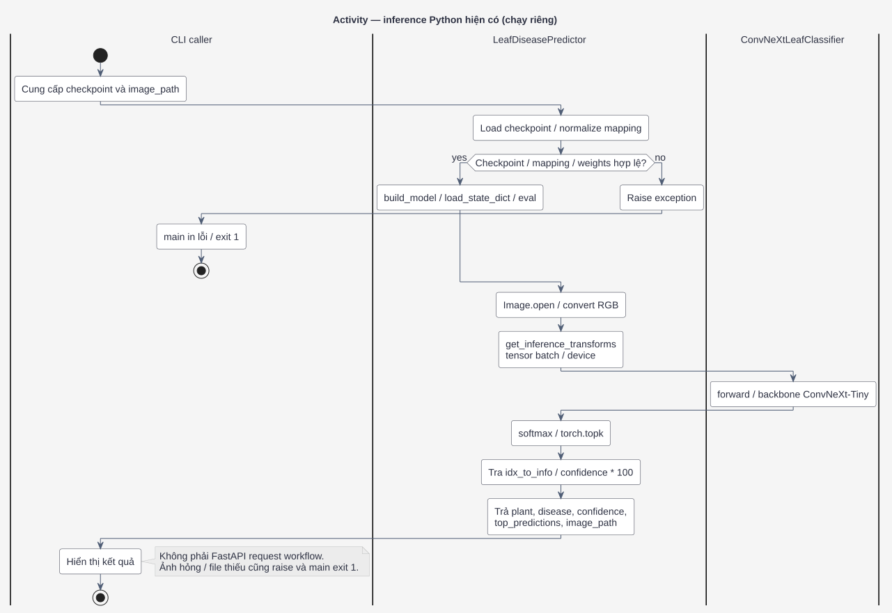

[Source editable](diagrams/activity_ai_cli.puml) · [SVG đầy đủ](diagrams/activity_ai_cli.svg)

### activity_authentication — HIỆN TẠI

Register/login và restore phiên, quyết định email trùng/BCrypt/JWT, lanes User/Frontend/Backend. Nguồn: AuthService, authApi. DB call thuộc backend action ở diagram này, sequence thể hiện DB riêng.

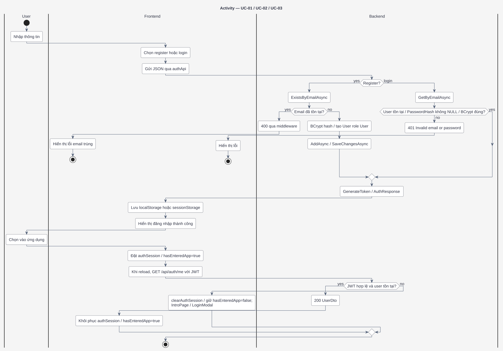

[Source editable](diagrams/activity_authentication.puml) · [SVG đầy đủ](diagrams/activity_authentication.svg)

### activity_history — HIỆN TẠI

List theo user/page; detail JWT/owner; DELETE owner/Admin. Storage false/exception giữ history, DB xóa cascade details/images sau storage thành công.

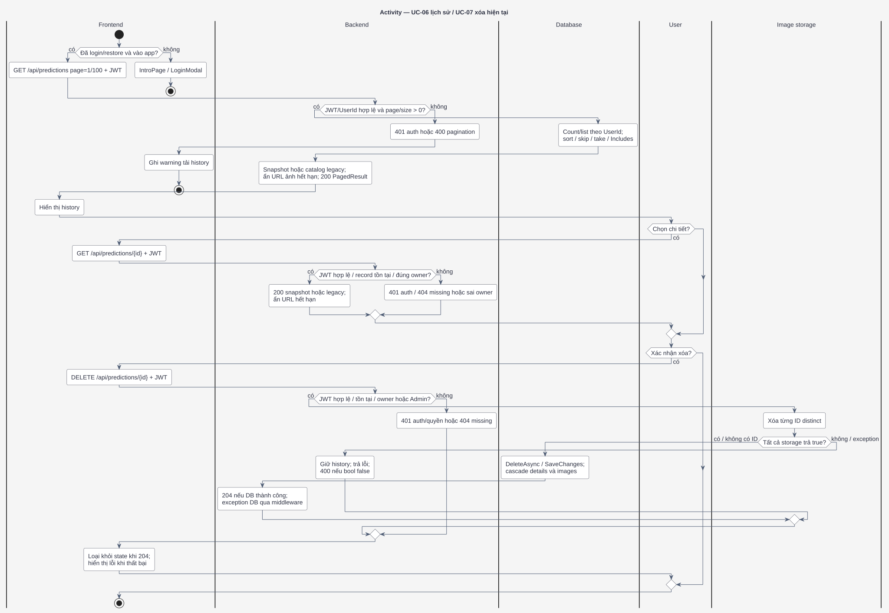

[Source editable](diagrams/activity_history.puml) · [SVG đầy đủ](diagrams/activity_history.svg)

### activity_prediction — HIỆN TẠI

API AI → strict mapping → nhánh khách 200 không persist / User upload+image+snapshot+DB 201. Lỗi trước upload không tạo ảnh; lỗi persistence cố cleanup giữ lỗi gốc.

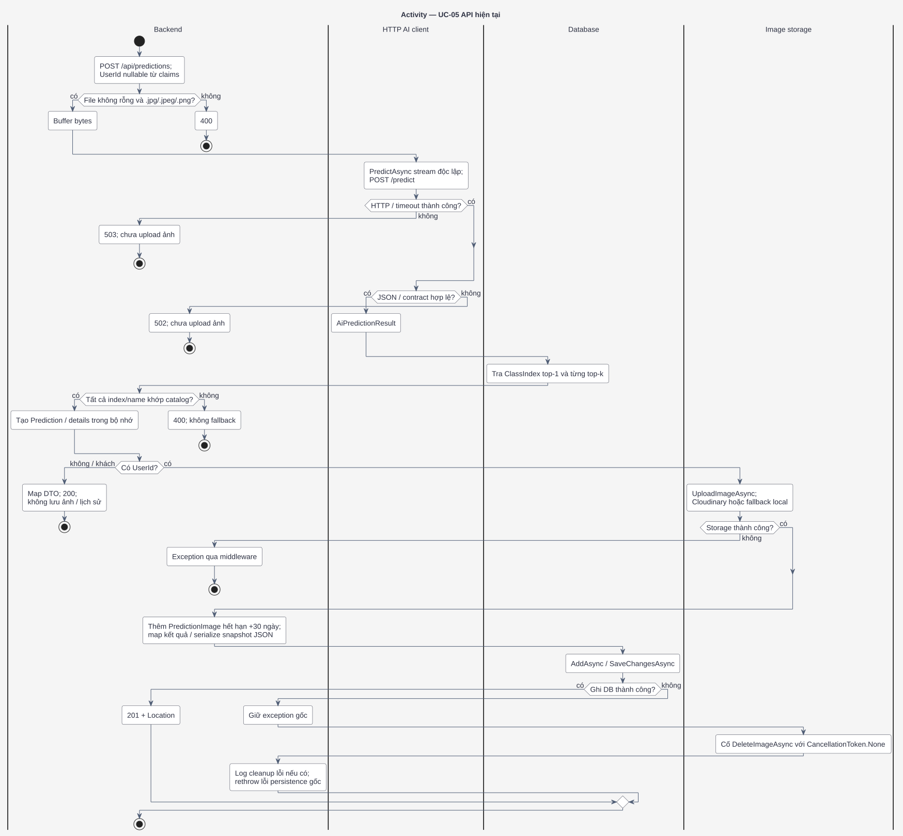

[Source editable](diagrams/activity_prediction.puml) · [SVG đầy đủ](diagrams/activity_prediction.svg)

### activity_result — HIỆN TẠI

DTO POST của lượt hiện tại; GET detail Authorize/UserId/owner, 401 hoặc 404. Snapshot hoặc catalog legacy, URL hết hạn ẩn. UI/storage ACL vẫn có khoảng trống.

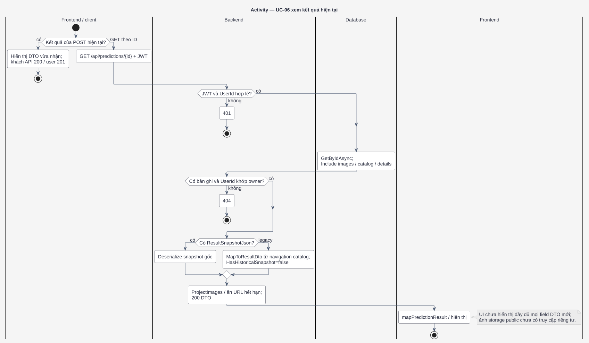

[Source editable](diagrams/activity_result.puml) · [SVG đầy đủ](diagrams/activity_result.svg)

### activity_upload — HIỆN TẠI

Chọn/drag-drop, validation UI, decode preview, gửi XHR và nhánh file lỗi. Không chứng minh server validation đầy đủ. Nguồn: DiagnosePage/imageFileValidation/predictionApi.

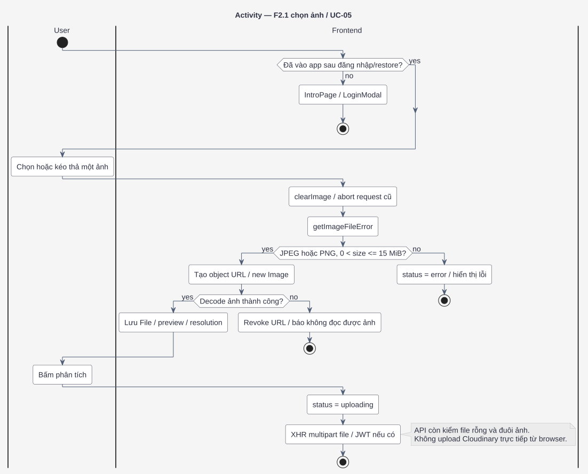

[Source editable](diagrams/activity_upload.puml) · [SVG đầy đủ](diagrams/activity_upload.svg)

### target_activity_authentication — MỤC TIÊU

FR-02: nhập credentials, kiểm BCrypt, lưu phiên hoặc báo lỗi; swimlane User/Frontend/Backend.

[Source editable](diagrams/target_activity_authentication.puml) · [SVG đầy đủ](diagrams/target_activity_authentication.svg)

### target_activity_history — MỤC TIÊU

MỤC TIÊU UX history/detail/delete của owner. JWT/owner/snapshot/expiry đã có source; UI phân trang/field mới và private image access còn thiếu.

[Source editable](diagrams/target_activity_history.puml) · [SVG đầy đủ](diagrams/target_activity_history.svg)

### target_activity_prediction — MỤC TIÊU

MỤC TIÊU nhánh một ảnh tài khoản: validation đầy đủ/HTTP model/UI field mới còn Planned; AI/mapping trước storage, snapshot/cleanup DB đã có source.

[Source editable](diagrams/target_activity_prediction.puml) · [SVG đầy đủ](diagrams/target_activity_prediction.svg)

## 5. Sequence — Tương tác giữa các thành phần

### sequence_ai_cli — HIỆN TẠI

Inference Python riêng với model thật trong code, chưa chạy checkpoint trong khảo sát tài liệu. Nêu HTTP/CLI contract khác nhau.

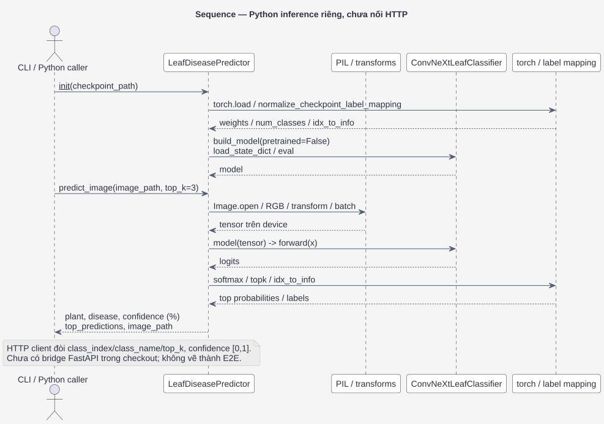

[Source editable](diagrams/sequence_ai_cli.puml) · [SVG đầy đủ](diagrams/sequence_ai_cli.svg)

### sequence_authentication — HIỆN TẠI

Register/login, UserRepository, BCrypt và JwtTokenGenerator; 200/400/401. Không có refresh hoặc endpoint logout tự thêm.

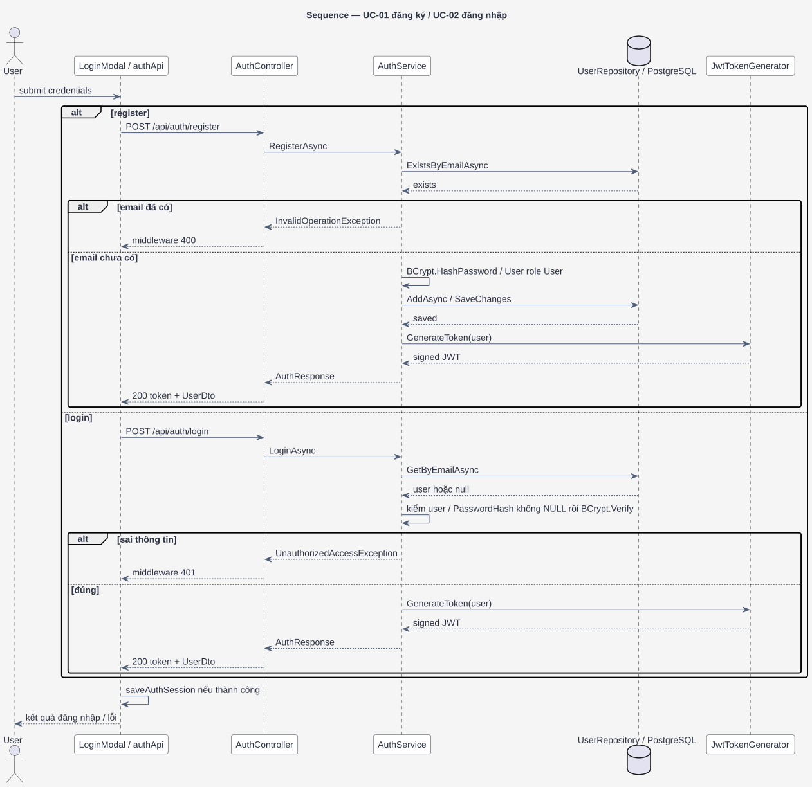

[Source editable](diagrams/sequence_authentication.puml) · [SVG đầy đủ](diagrams/sequence_authentication.svg)

### sequence_catalog — HIỆN TẠI

GET public; CRUD Admin; DELETE đặt IsActive=false/UpdatedAt, không xóa cứng. Unique/DB update error vẫn qua middleware; UI Admin chưa có.

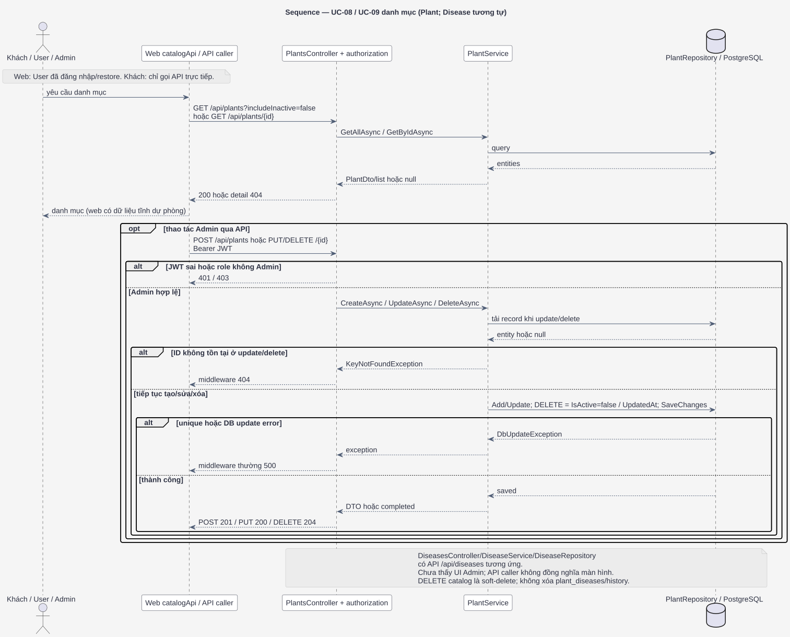

[Source editable](diagrams/sequence_catalog.puml) · [SVG đầy đủ](diagrams/sequence_catalog.svg)

### sequence_delete — HIỆN TẠI

JWT + owner/Admin; distinct IDs mới/legacy. Storage false →400 giữ history, exception dừng DB; true rồi DeleteAsync cascade details/images. Không distributed transaction.

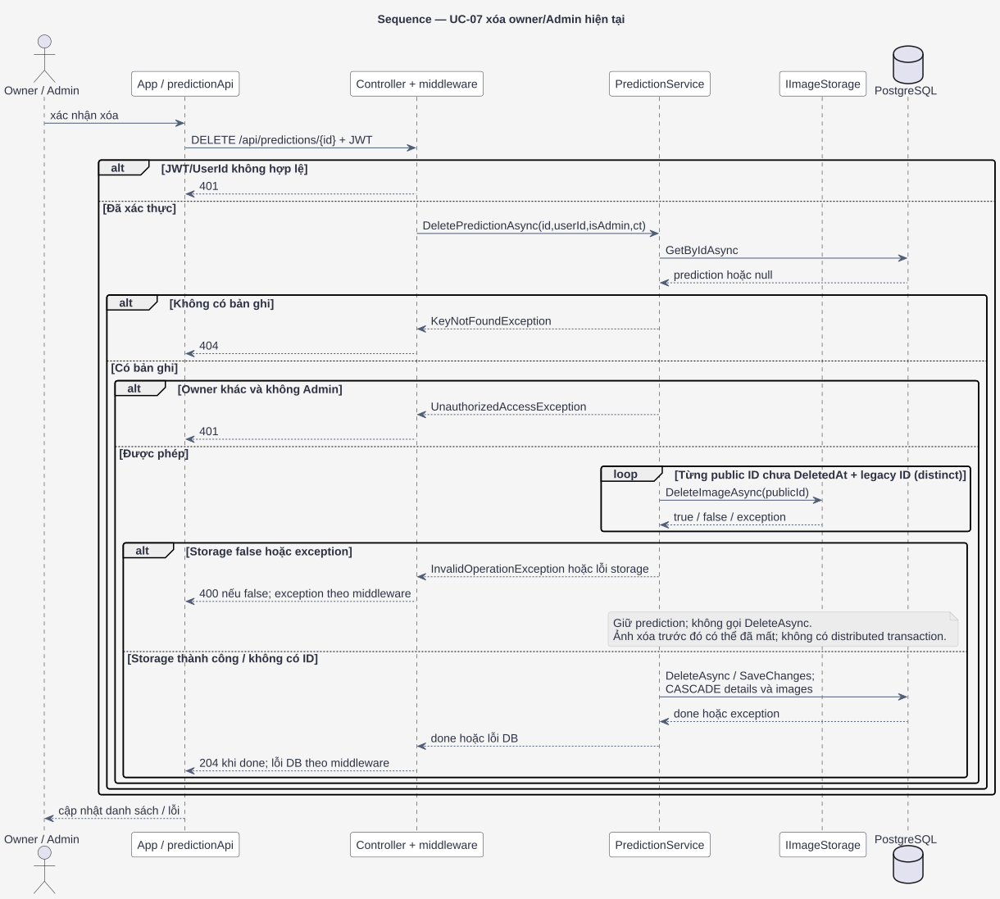

[Source editable](diagrams/sequence_delete.puml) · [SVG đầy đủ](diagrams/sequence_delete.svg)

### sequence_history — HIỆN TẠI

GET list/detail có Authorize và claims. Detail gọi GetPredictionByIdAsync(id,ct,userId), missing/sai owner 404; guest 401. Snapshot/legacy + images expiry; Admin không đọc record khác.

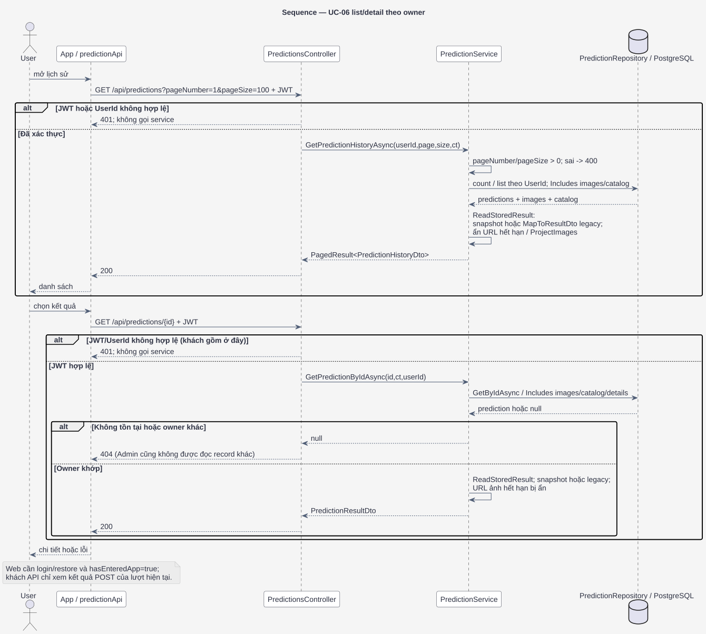

[Source editable](diagrams/sequence_history.puml) · [SVG đầy đủ](diagrams/sequence_history.svg)

### sequence_prediction — HIỆN TẠI

HTTP contract / DB mapping trước storage; khách 200 không AddAsync, User 201 sau SaveChanges image/snapshot. Web guest chưa mở main UI; AI HTTP chưa nghiệm thu model.

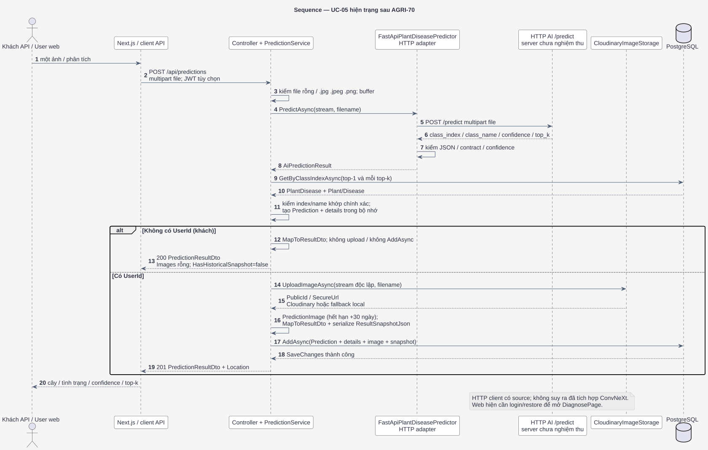

[Source editable](diagrams/sequence_prediction.puml) · [SVG đầy đủ](diagrams/sequence_prediction.svg)

### sequence_prediction_errors — HIỆN TẠI

400 file/mapping, 503 AI/502 contract; không upload trước AI. Guest 200; User DB error cố cleanup, log cleanup lỗi rồi rethrow persistence error gốc.

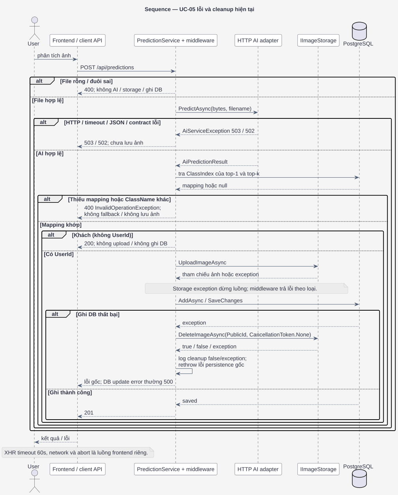

[Source editable](diagrams/sequence_prediction_errors.puml) · [SVG đầy đủ](diagrams/sequence_prediction_errors.svg)

### sequence_session — HIỆN TẠI

Restore qua me, nhánh token/user lỗi, sửa hồ sơ state và logout browser không revoke JWT. Nguồn: App, ProfilePage, authApi, AuthController/AuthService.

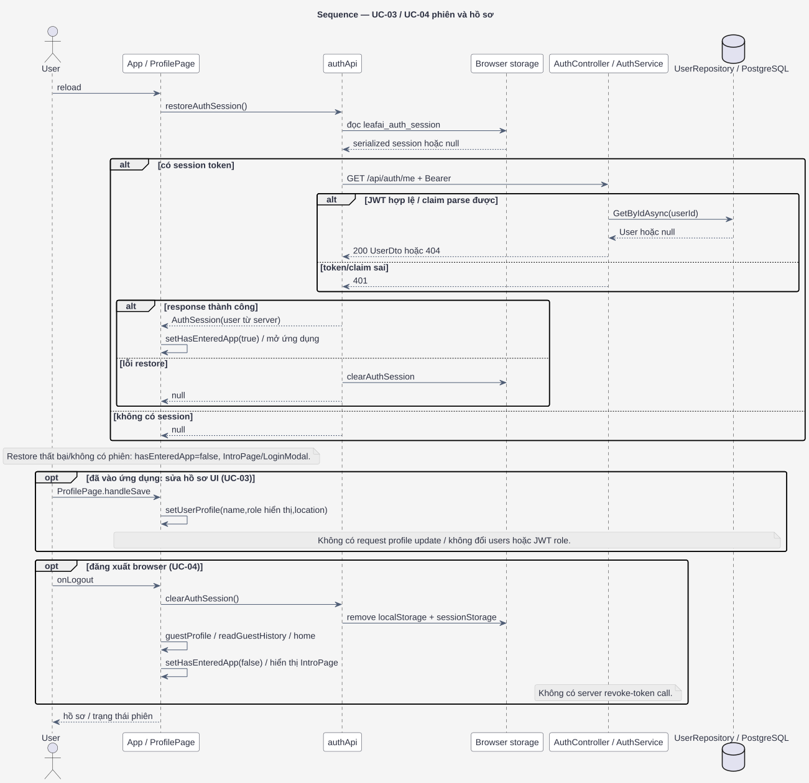

[Source editable](diagrams/sequence_session.puml) · [SVG đầy đủ](diagrams/sequence_session.svg)

### target_sequence_authentication — MỤC TIÊU

POST login, đọc users, JWT và nhánh 401.

[Source editable](diagrams/target_sequence_authentication.puml) · [SVG đầy đủ](diagrams/target_sequence_authentication.svg)

### target_sequence_history — MỤC TIÊU

MỤC TIÊU owner history/list/detail/delete; không gắn JWT/owner GET ID là Planned nữa. Không chứng minh UI hoặc private storage đã nghiệm thu.

[Source editable](diagrams/target_sequence_history.puml) · [SVG đầy đủ](diagrams/target_sequence_history.svg)

### target_sequence_prediction — MỤC TIÊU

MỤC TIÊU FastAPI → ConvNeXt HTTP chưa nghiệm thu. Mapping strict trước upload; persistence/snapshot/cleanup theo source đã có. POST khách vẫn public, nhánh này chỉ tài khoản.

[Source editable](diagrams/target_sequence_prediction.puml) · [SVG đầy đủ](diagrams/target_sequence_prediction.svg)

## 6. Class — Cấu trúc source code

### class_ai — HIỆN TẠI

LeafDiseasePredictor, ConvNeXtLeafClassifier/nn.Module, dependencies tới modules transform/build_model. Không thêm FastAPI class không tồn tại.

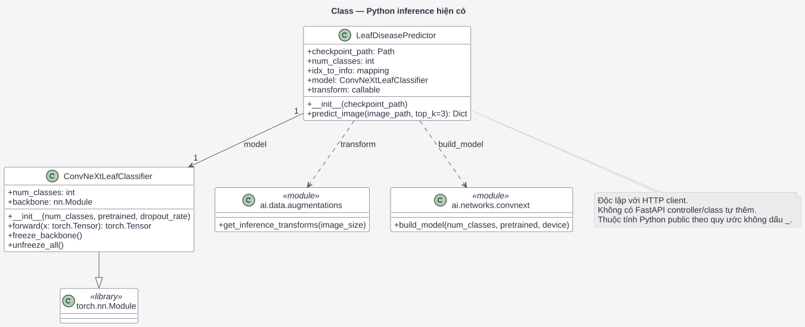

[Source editable](diagrams/class_ai.puml) · [SVG đầy đủ](diagrams/class_ai.svg)

### class_auth_catalog — HIỆN TẠI

Authentication và các chuỗi controller → service → repository của danh mục. Disease operations tương tự Plant và lược trong hình, không phải lớp chưa implement.

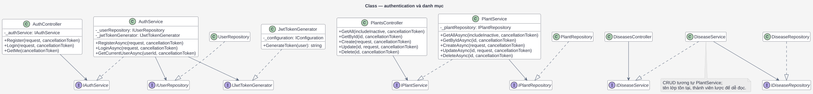

[Source editable](diagrams/class_auth_catalog.puml) · [SVG đầy đủ](diagrams/class_auth_catalog.svg)

### class_dtos — HIỆN TẠI

PredictionResultDto/HistoryDto thêm Images/HasHistoricalSnapshot; Result warning/content/medication; PredictionImageDto. DTO/AI records là payload, không bảng.

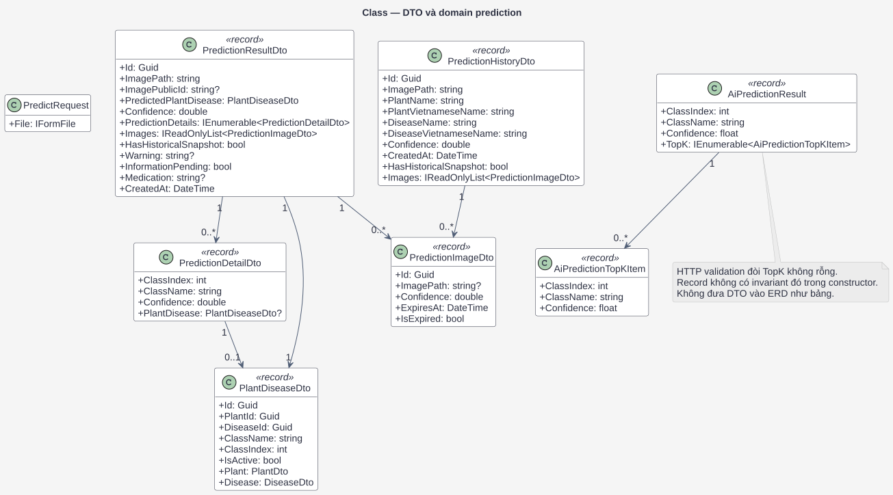

[Source editable](diagrams/class_dtos.puml) · [SVG đầy đủ](diagrams/class_dtos.svg)

### class_entities — HIỆN TẠI

Chín entity, public auto-properties và navigation đúng tên C#; PasswordHash nullable/EmailVerifiedAt, Disease condition/approval/medication, ResultSnapshotJson/Images và ba entity mới. Không dùng cascade DB để tự suy composition.

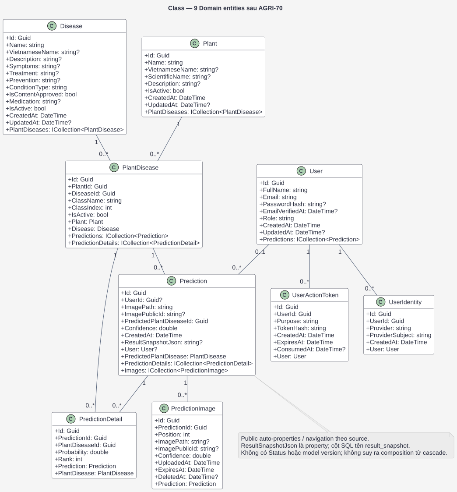

[Source editable](diagrams/class_entities.puml) · [SVG đầy đủ](diagrams/class_entities.svg)

### class_infrastructure — HIỆN TẠI

Repos/adapters/DbContext inheritance/DI; đủ 9 DbSet, ImageExpiryCleanup.RunAsync/DbInitializer.SeedAsync static. Không tự thêm UnitOfWork/settings class.

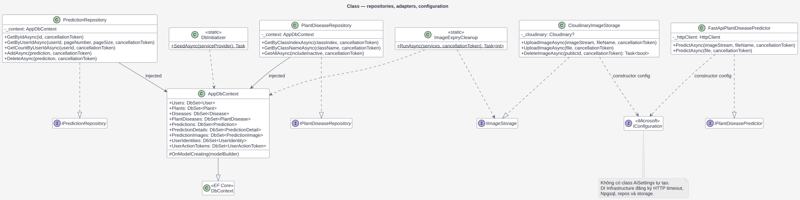

[Source editable](diagrams/class_infrastructure.puml) · [SVG đầy đủ](diagrams/class_infrastructure.svg)

### class_prediction — HIỆN TẠI

Controller/service/repository/storage/predictor interfaces; chữ ký GetPredictionByIdAsync(id,ct,userId), logger, private static MapToResultDto/ReadStoredResult/ProjectImages theo source.

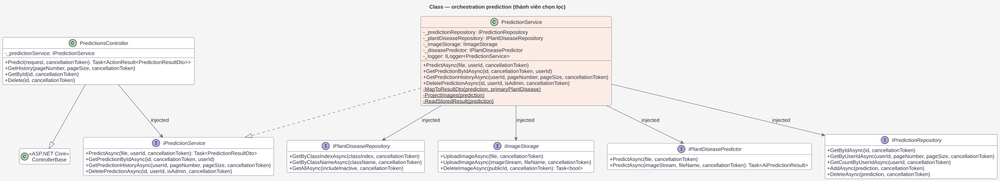

[Source editable](diagrams/class_prediction.puml) · [SVG đầy đủ](diagrams/class_prediction.svg)

## 7. State — Vòng đời trạng thái

### state_prediction_ui — HIỆN TẠI

State machine đúng union PredictionStatus: idle/uploading/analyzing/success/error, events/guards/reset/abort. Upload resolve có thể thành success trực tiếp nếu callback analyzing chưa xảy ra. Ảnh hợp lệ vẫn idle; isPreparing là state riêng. Entity Prediction không có lifecycle field; lựa chọn State UI thay Prediction DB cần Team Lead xác nhận khi nghiệm thu.

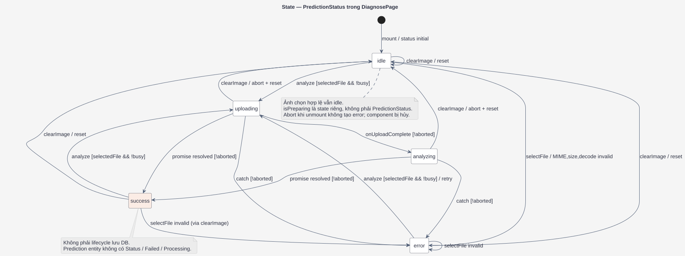

[Source editable](diagrams/state_prediction_ui.puml) · [SVG đầy đủ](diagrams/state_prediction_ui.svg)

### target_state_prediction — MỤC TIÊU

State logic đề xuất một ảnh tài khoản; validation → AI/mapping → storage → DB/snapshot → completed/failed. Không enum/cột DB; khác PredictionStatus UI.

[Source editable](diagrams/target_state_prediction.puml) · [SVG đầy đủ](diagrams/target_state_prediction.svg)

## 8. ERD — Cấu trúc database hiện tại

### erd_current — HIỆN TẠI

HIỆN TẠI 07/10/2026: chín bảng/69 cột nghiệp vụ từ database_schema_current.json; PK/FK/type/nullable/default/unique/CHECK và ON DELETE. Property ResultSnapshotJson map cột result_snapshot. Bảng EF history kỹ thuật nằm trong metadata, không tính entity nghiệp vụ. Schema auth/nhiều ảnh không chứng minh endpoint đã hoàn thiện.

[Source editable](diagrams/erd_current.puml) · [SVG đầy đủ](diagrams/erd_current.svg)

### erd — BASELINE LỊCH SỬ

BASELINE LỊCH SỬ 05/10/2026: giữ nguyên sáu bảng theo InitialCreate và metadata cũ; không là ERD database ứng dụng sau AGRI-70. Chen/SQL agrivision_erd cũng thuộc baseline.

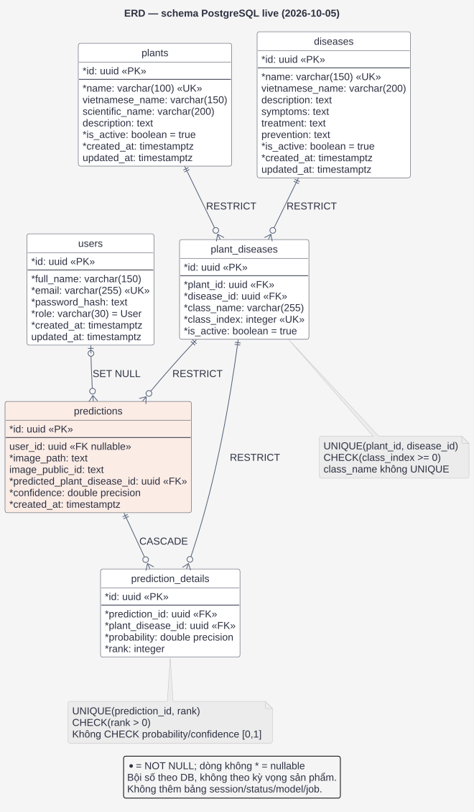

[Source editable](diagrams/erd.puml) · [SVG đầy đủ](diagrams/erd.svg)
