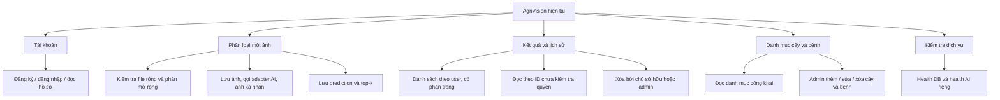
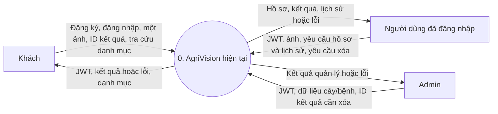
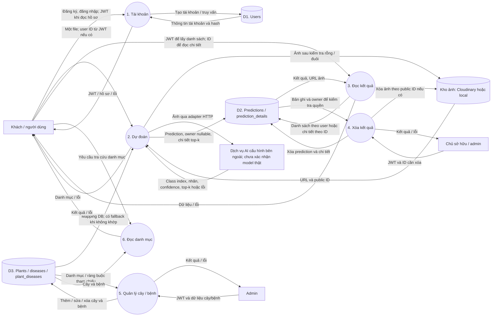
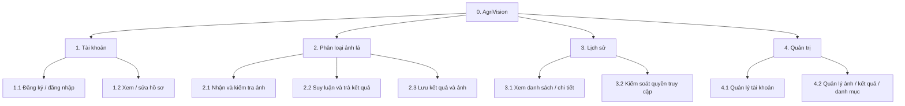
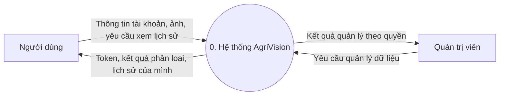
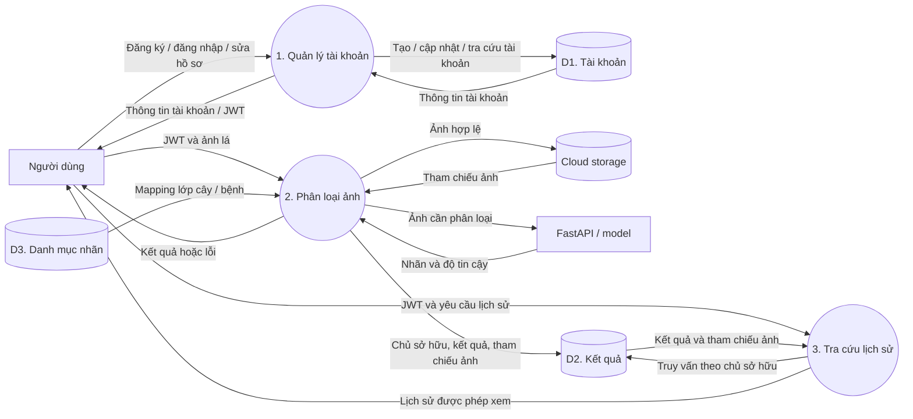
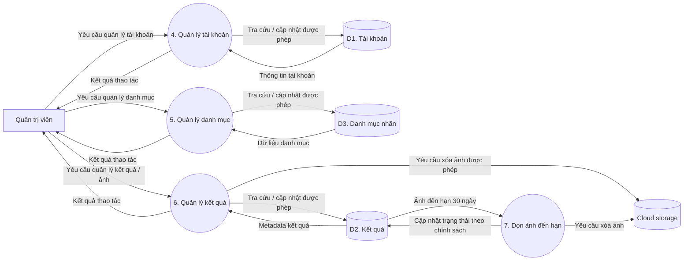
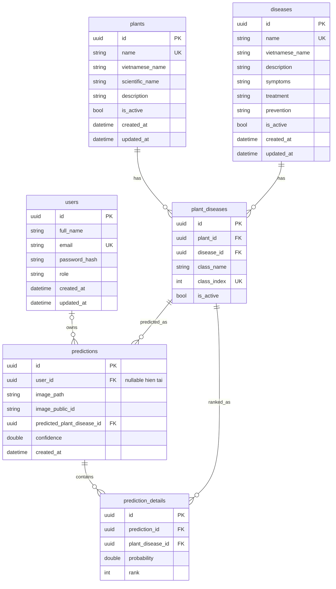

# Sơ đồ thiết kế hệ thống AgriVision

> AGRI-76, đối chiếu source ngày 2026-10-03 trên nền commit `094ec6e`. Phần 1 mô tả hiện trạng API; phần 2 giữ thiết kế mục tiêu ngày 2026-09-30 để tham khảo, không tính là chức năng đã có. ERD ở phần 3 phản ánh schema hiện có. Xem [đặc tả yêu cầu](system_requirements.md) và [báo cáo AGRI-76](reports/AGRI-76/README.md).

## 1. Phân tích hệ thống hiện tại — đầu ra AGRI-76

Ranh giới gồm web Next.js, API ASP.NET Core, PostgreSQL và adapter lưu ảnh. Adapter HTTP gọi AI là mã hiện có; FastAPI phục vụ checkpoint thật chưa được kiểm chứng xuyên tầng. Các sơ đồ phản ánh khả năng và thiếu sót của API, không khẳng định mọi thao tác đã có màn hình hoặc đã chạy thành công.

### 1.1. BFD hiện trạng

Không đưa sửa hồ sơ, CRUD tài khoản, upload nhiều ảnh/request hay dọn ảnh 30 ngày vào BFD hiện trạng vì chưa có các luồng này trong source được đối chiếu.

### 1.2. DFD ngữ cảnh hiện trạng

POST dự đoán và GET kết quả theo ID hiện chưa có `[Authorize]`; việc khách gọi được là **khoảng trống bảo mật**, không phải quyền sản phẩm mong muốn. GET danh sách chỉ trả dữ liệu theo user; DELETE kiểm tra chủ sở hữu hoặc admin. Chi tiết ở [ma trận hiện trạng](system_requirements.md#8-ma-trận-truy-vết-yêu-cầu-và-hiện-trạng).

### 1.3. DFD mức 1 hiện trạng

`D1`–`D3` là nhóm bảng trong cùng PostgreSQL. API upload trước khi gọi AI; source chưa có cleanup ảnh khi AI/DB lỗi. Adapter AI báo lỗi dịch vụ, nhưng `PredictionService` vẫn fallback sang lớp DB đầu tiên nếu top-1 không khớp và sang lớp chính nếu top-k không khớp. Không diễn giải luồng này thành mapping đúng hoặc model đã được nghiệm thu. GET theo ID chưa lọc owner; chưa có kiểm tra nội dung ảnh, giới hạn nghiệp vụ 30 MB hay scheduler hết hạn ảnh. Health DB ở `/api/health`, health AI ở `/api/health/deps`, là luồng vận hành riêng, không phải suy luận.

## 2. Thiết kế mục tiêu — không phải hiện trạng AGRI-76

Giữ các sơ đồ đề xuất bên dưới để không mất yêu cầu nhóm đã cung cấp. Chỉ dùng sau khi chốt phạm vi, tiêu chí chấp nhận và triển khai; không dùng làm bằng chứng hoàn thành chức năng.

### 2.1. BFD mục tiêu — phân rã chức năng

BFD chia chức năng của phiên bản đầu thành bốn nhóm. Các mục gợi ý thuốc theo giai đoạn và giải thích nguyên nhân bệnh nằm ngoài phiên bản này. Sơ đồ thể hiện **chức năng**, không biểu diễn thứ tự thực hiện hay luồng dữ liệu.

Các nhánh tương ứng [FR-01–FR-09](system_requirements.md#3-yêu-cầu-chức-năng). Thao tác quản trị cụ thể và sửa hồ sơ vẫn cần được chốt ở đặc tả.

### 2.2. DFD mức ngữ cảnh mục tiêu

Ở mức này, AgriVision là một tiến trình duy nhất. Người dùng và quản trị viên là tác nhân bên ngoài. FastAPI, PostgreSQL và cloud storage được triển khai bên trong ranh giới hệ thống nên xuất hiện ở sơ đồ chi tiết thay vì mức ngữ cảnh.

Yêu cầu phân loại và xem lịch sử chỉ được xử lý khi người dùng đã đăng nhập. Quyền quản trị đối với ảnh và dữ liệu cá nhân cần được giới hạn theo quyết định ở [đặc tả](system_requirements.md#6-quyết-định-còn-mở).

### 2.3. DFD mức 1 mục tiêu — luồng người dùng

Sơ đồ dưới đây phân rã các luồng tài khoản, phân loại và lịch sử. Mũi tên mang **dữ liệu**, không phải thứ tự gọi hàm. `D1`–`D3` là các nhóm dữ liệu trong cùng PostgreSQL: `D1` là tài khoản, `D2` là kết quả/chi tiết xếp hạng, `D3` là danh mục cây/bệnh/lớp nhãn. Cloud storage chỉ lưu ảnh; database lưu tham chiếu ảnh.

Tại tiến trình 2, API phải kiểm tra JWT và quyền gửi ảnh, giới hạn dung lượng/định dạng/nội dung. Chỉ khi model trả kết quả hợp lệ và mapping `D3` khớp mới ghi `D2`; lỗi AI không tạo bản ghi dự đoán thành công. Cần xử lý ảnh đã tải lên nếu bước suy luận hoặc lưu DB thất bại. Tại tiến trình 3, API lọc theo chủ tài khoản trước khi trả bản ghi hoặc đường dẫn ảnh.

### 2.4. DFD mức 1 mục tiêu — luồng quản trị và hết hạn ảnh

Các tiến trình quản trị sau đây là **thiết kế mục tiêu**, chưa được xác nhận đã triển khai đầy đủ. `D1`–`D3` mang cùng ý nghĩa như sơ đồ ở phần 2.3. Tiến trình dọn ảnh là tác vụ hệ thống; thời điểm chạy, cách xử lý lỗi và việc giữ bản ghi lịch sử cần chốt.

Popup xác nhận xóa ở giao diện đi trước tiến trình quản trị; server vẫn phải kiểm tra quyền và ràng buộc dữ liệu. Không xóa bản ghi lịch sử hoặc thay đổi khóa ngoại theo một quy tắc chưa được nhóm duyệt.

## 3. ERD và cấu trúc dữ liệu hiện tại

### ERD khái niệm theo ký pháp Chen

Sơ đồ dưới đây dùng **hình chữ nhật cho thực thể, hình bầu dục cho thuộc tính và hình thoi cho quan hệ**, theo phong cách hình mẫu. Thuộc tính `id` được gạch chân để chỉ khóa chính. Sơ đồ chỉ giữ những thuộc tính tiêu biểu để dễ đọc; phần ERD bảng bên dưới liệt kê các trường còn lại.

[Mở SVG ở kích thước đầy đủ](assets/agrivision_initial_create_chen_erd.svg). Bội số `0..1` ở phía `User` phản ánh `predictions.user_id` **đang cho phép NULL**. Mục tiêu sản phẩm yêu cầu đăng nhập trước khi dự đoán; việc đổi ràng buộc DB chỉ thực hiện sau khi xử lý dữ liệu cũ và chốt quy tắc xóa tài khoản. Hai quan hệ tới `Prediction Detail` lần lượt biểu diễn bản ghi dự đoán sở hữu các hạng và mỗi hạng tham chiếu một lớp cây/bệnh.

### ERD bảng và ràng buộc hiện tại

Sơ đồ sau phản ánh sáu bảng trong [`InitialCreate` migration](../backend/src/AgriVision.Infrastructure/Persistence/Migrations/20260925161222_InitialCreate.cs) và [EF Core configurations](../backend/src/AgriVision.Infrastructure/Persistence/Configurations/). Các trường khóa và trường có ý nghĩa nghiệp vụ được thể hiện; bảng bên dưới bổ sung ràng buộc. `users` và `predictions` hiện là quan hệ tùy chọn do `user_id` cho phép `NULL`.

`UK` biểu thị unique index. `image_path` và `image_public_id` là tham chiếu tới nơi lưu ảnh, không phải dữ liệu ảnh nhị phân. `prediction_details` biểu diễn các lớp xếp hạng của **một ảnh**, không phải nhiều ảnh của một lần gửi.

| Bảng | Khóa, ràng buộc và mục đích hiện tại |
|---|---|
| `users` | PK `id`; `email` duy nhất; `role` mặc định `User`. Lưu thông tin tài khoản và hash mật khẩu. |
| `plants` | PK `id`; `name` duy nhất; danh mục cây. |
| `diseases` | PK `id`; `name` duy nhất; thông tin bệnh. Các cột `treatment`/`prevention` đã tồn tại, nhưng **gợi ý thuốc theo giai đoạn** chưa thuộc MVP. |
| `plant_diseases` | PK `id`; FK tới cây/bệnh; duy nhất `(plant_id, disease_id)` và `class_index`; `class_index >= 0`. Lớp nhãn cần khớp mapping model được duyệt. |
| `predictions` | PK `id`; FK `user_id` hiện nullable, xóa user thì `SET NULL`; FK lớp dự đoán có `RESTRICT`; lưu tham chiếu một ảnh, confidence và thời điểm. |
| `prediction_details` | PK `id`; FK prediction `CASCADE`, FK lớp `RESTRICT`; `(prediction_id, rank)` duy nhất và `rank > 0`. |

### Điều chỉnh cần thiết so với yêu cầu mới

| Chủ đề | Hiện tại | Hướng điều chỉnh cần duyệt và triển khai |
|---|---|---|
| Bắt buộc đăng nhập | `predictions.user_id` nullable; POST dự đoán chưa có `[Authorize]`. | Yêu cầu xác thực cho POST và các đường đọc kết quả; sau khi xử lý dữ liệu guest cũ, cân nhắc migration `user_id NOT NULL`. |
| Quyền xem kết quả | GET theo ID chưa xác thực/kiểm tra chủ sở hữu. | Kiểm tra quyền trên server trước khi trả metadata và URL ảnh; chốt quyền admin. |
| Sửa hồ sơ | Có `/api/auth/me` để đọc; chưa thấy endpoint sửa hồ sơ. | Thêm thao tác sửa các trường được duyệt, xác thực chủ tài khoản. |
| Nhiều ảnh | API và bảng `predictions` nhận/lưu từng ảnh. | Nếu cần một request nhiều ảnh, xử lý từng ảnh và trả trạng thái từng ảnh; chốt có cần nhóm lần gửi và giới hạn số ảnh/request. |
| Cloud và hạn lưu | Có adapter Cloudinary với đường lui lưu local; chưa có chính sách xóa sau 30 ngày. | Đảm bảo ảnh sản phẩm lên cloud; thêm chính sách xóa 30 ngày và trạng thái ảnh đã hết hạn; kiểm tra ảnh và dung lượng ở server. |
| Vòng đời tài khoản | Xóa user hiện làm `predictions.user_id = NULL`. | Chốt xóa cứng, xóa mềm hay ẩn danh; quyết định xóa/giữ lịch sử, ảnh và cách tuân thủ quyền riêng tư rồi mới đổi FK. |
| Danh mục cây/bệnh | FK `RESTRICT` ngăn xóa khi còn quan hệ tham chiếu. | Ưu tiên ngừng sử dụng bằng `is_active` nếu cần giữ lịch sử; popup không thay ràng buộc DB. |
| Phiên bản model | Chưa có cột model/dataset version. | Chốt nguồn/version trước khi thêm migration; không dùng seed minh họa làm mapping thật. |

## 4. Nguồn đối chiếu trong repo

- [Entity](../backend/src/AgriVision.Domain/Entities/) và [migration đầu tiên](../backend/src/AgriVision.Infrastructure/Persistence/Migrations/20260925161222_InitialCreate.cs): bảng, khóa, quan hệ hiện có.
- [PredictionsController](../backend/src/AgriVision.API/Controllers/PredictionsController.cs), [AuthController](../backend/src/AgriVision.API/Controllers/AuthController.cs), [PredictionService](../backend/src/AgriVision.Application/Services/Implementations/PredictionService.cs): luồng API hiện tại.
- [CloudinaryImageStorage](../backend/src/AgriVision.Infrastructure/Services/CloudinaryImageStorage.cs), [FastApiPlantDiseasePredictor](../backend/src/AgriVision.Infrastructure/Services/FastApiPlantDiseasePredictor.cs): adapter đang có, không chứng minh checkpoint thật đã sẵn sàng.
- [PlantsController](../backend/src/AgriVision.API/Controllers/PlantsController.cs), [DiseasesController](../backend/src/AgriVision.API/Controllers/DiseasesController.cs), [HealthController](../backend/src/AgriVision.API/Controllers/HealthController.cs): phạm vi quản trị danh mục và health hiện có.
- [Lộ trình phát triển](development_roadmap.md): kế hoạch và bằng chứng CI theo commit, không thay cho nghiệm thu model thật.
