# Sơ đồ thiết kế hệ thống AgriVision

> **Đối chiếu 07/10/2026:** Bộ [AGRI-76](reports/AGRI-76/README.md) đã cập nhật theo source/schema sau AGRI-70.
> [ERD hiện tại 9 bảng](reports/AGRI-76/diagrams/erd_current.svg) và [metadata live](reports/AGRI-76/assets/database_schema_current.json).
> ERD 6 bảng/Chen/SQL cũ giữ nguyên làm baseline lịch sử. [Tổng hợp 36 sơ đồ](reports/AGRI-76/diagram_compendium.md).
> State hiện tại là PredictionStatus UI; target_* là đề xuất, không thêm DB status hoặc coi FastAPI đã nghiệm thu.

## 1. Phân tích hệ thống hiện tại — đầu ra AGRI-76

Ranh giới DFD gồm web Next.js, API ASP.NET Core, PostgreSQL, phiên trình duyệt và kho ảnh local. Dịch vụ HTTP AI và Cloudinary là external entities; Cloudinary tham gia khi được cấu hình, ảnh chuyển sang local nếu thiếu cấu hình hoặc upload lỗi. Adapter HTTP AI có code, nhưng FastAPI phục vụ checkpoint thật chưa được kiểm chứng xuyên tầng.

Web chính chỉ mở sau đăng nhập hoặc restore phiên thành công (`hasEnteredApp=true`); logout trở về IntroPage/LoginModal. Khách đăng ký/login trên web và có thể gọi trực tiếp các API công khai về POST prediction/catalog. Các nhánh guest profile/history còn trong code nhưng chưa có đường vào UI hiện tại. Có code không đồng nghĩa đã kiểm thử chức năng thành công.

### 1.1. BFD hiện trạng

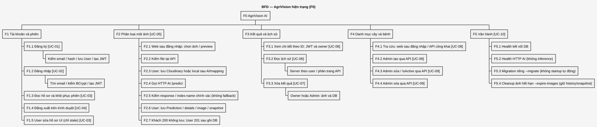

[Source editable](reports/AGRI-76/diagrams/bfd.puml) · [SVG đầy đủ](reports/AGRI-76/diagrams/bfd.svg) · [Mapping BFD → Use Case và các mô hình](reports/AGRI-76/traceability.md).

ID chức năng thống nhất với bộ AGRI-76: F1.1 đăng ký, F1.2 đăng nhập, F1.3 đọc hồ sơ/restore, F1.4 logout browser, F1.5 sửa hồ sơ UI. F1.5 chỉ đổi state cho user đã vào ứng dụng, chưa lưu DB hoặc đổi JWT role. CRUD tài khoản, sửa hồ sơ server, upload nhiều ảnh/request và scheduler ảnh 30 ngày vẫn là Planned/Future, không đưa vào BFD hiện trạng.

### 1.2. DFD ngữ cảnh hiện trạng

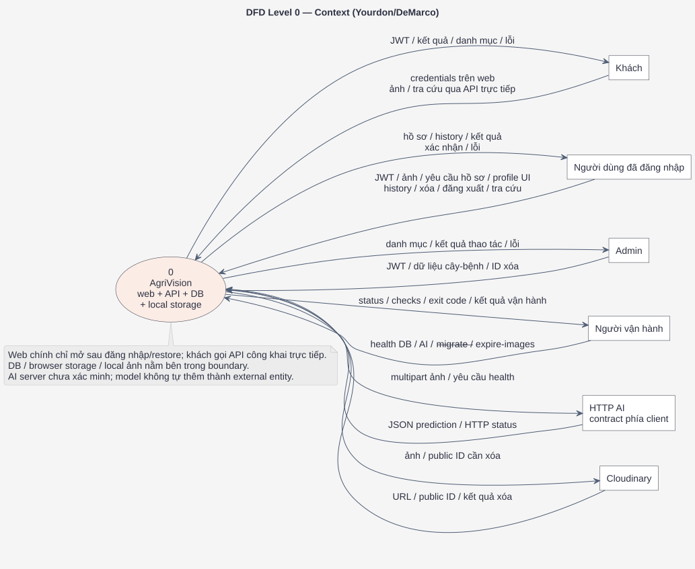

[Source editable](reports/AGRI-76/diagrams/dfd_context.puml) · [SVG đầy đủ](reports/AGRI-76/diagrams/dfd_context.svg).

Context giữ một process 0; ngoài Khách/User/Admin còn có Người vận hành, HTTP AI và Cloudinary, cùng request/response tương ứng. PostgreSQL, phiên browser và ảnh local nằm trong hệ thống, không xuất hiện thành external entities ở context.

POST dự đoán công khai; GET list/detail có Authorize, detail kiểm owner. Khách được dự đoán theo QD-01; POST công khai tự nó không trái quyền mục tiêu. GET record thiếu/sai owner trả 404; khách/token sai trả 401. URL storage riêng tư vẫn còn khoảng trống. GET danh sách chỉ trả dữ liệu theo user; DELETE kiểm tra chủ sở hữu hoặc admin. Chi tiết source hiện tại ở [System Analysis](reports/AGRI-76/system_analysis.md); [ma trận lịch sử 05/10](system_requirements.md#8-ma-trận-truy-vết-yêu-cầu-và-baseline-khảo-sát-2026-10-05) giữ riêng.

### 1.3. DFD mức 1 hiện trạng

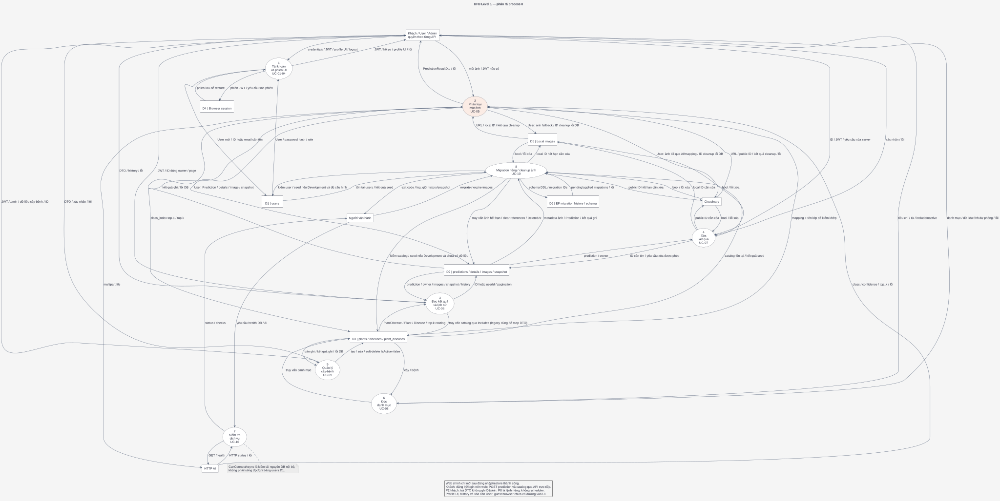

[Source editable](reports/AGRI-76/diagrams/dfd_level_1.puml) · [SVG đầy đủ](reports/AGRI-76/diagrams/dfd_level_1.svg) · [DFD Level 2 prediction](reports/AGRI-76/diagrams/dfd_level_2_prediction.svg) · [DFD Level 2 authentication](reports/AGRI-76/diagrams/dfd_level_2_auth.svg).

P1–P7 và các external entities dùng cùng ID/ranh giới với bộ chi tiết. D1–D3 là nhóm bảng PostgreSQL; D4 lưu phiên browser, D5 lưu ảnh local. Cloudinary được vẽ riêng như external entity. P2 ghi Prediction/PredictionDetail vào D2 và nhận **kết quả ghi / lỗi DB** từ D2; Level 2 giữ cùng luồng qua P2.6. [Balancing ledger](reports/AGRI-76/traceability.md#3-kiểm-tra-balancing-dfd) đối chiếu các biên process. P7 kiểm kết nối DB và gọi AI `/health`, không chạy inference.

D1–D3 là nhóm bảng nghiệp vụ PostgreSQL; D6 là migration history/schema kỹ thuật.
P2 gọi AI/strict mapping trước storage, khách 200 không ghi ảnh/history, User 201 sau image/snapshot/DB.
P3 đọc D2 và catalog D3 qua Includes, legacy thiếu snapshot dùng catalog dựng DTO.
Lỗi persistence cố cleanup ảnh; GET ID đã JWT/owner. P8 là --migrate/--expire-images riêng,
giữ snapshot khi expiry; chưa scheduler. P5 DELETE catalog soft-delete. Validation nội dung/tổng lượt
và FastAPI inference thật vẫn chưa đầy đủ. Xem [analysis hiện tại](reports/AGRI-76/system_analysis.md).

## 2. Thiết kế mục tiêu — không phải hiện trạng AGRI-76

Cập nhật yêu cầu ngày 2026-10-06 theo [Yêu cầu mục tiêu](system_requirements.md), [Yêu cầu mục tiêu](system_requirements.md) và [đặc tả mục tiêu](system_requirements.md). Phần 1 và ERD ở phần 3 phản ánh source/schema khảo sát; gallery phân biệt hiện tại, ERD lịch sử và 7 sơ đồ target_. Snapshot đã có source; Google/email/reset/multi-image endpoints vẫn chưa đầy đủ.

Các sơ đồ bên dưới thể hiện một phần thiết kế mục tiêu, chưa bao phủ toàn bộ yêu cầu đã chốt. Chi tiết contract/schema còn cần thiết kế và triển khai. Khi một nhánh chưa được vẽ, yêu cầu vẫn theo AC nguồn; không dùng sự thiếu vắng đó để chuyển quyết định đã chốt thành yêu cầu còn mở. Không dùng sơ đồ mục tiêu làm bằng chứng hoàn thành chức năng.

### 2.1. BFD mục tiêu — phân rã chức năng

BFD chia chức năng mục tiêu thành bốn nhóm. Mô tả/hướng xử lý/thuốc kiểm duyệt theo US-03 đã nằm trong phạm vi; gợi ý theo giai đoạn/mức độ nặng và giải thích nguyên nhân bằng mô hình chưa thuộc phạm vi. Sơ đồ thể hiện **chức năng**, không biểu diễn thứ tự thực hiện hay luồng dữ liệu.

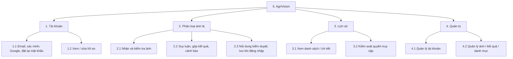

Các nhánh tương ứng [FR-01–FR-09](system_requirements.md#3-yêu-cầu-chức-năng). Nhánh sửa hồ sơ (FR-03) và quản trị (FR-08/FR-09) là phạm vi từ đặc tả cũ, chưa được xác nhận trong phỏng vấn; việc xuất hiện trên BFD không xác nhận các nhánh này đã được duyệt. BFD này cũng chưa vẽ riêng chức năng người dùng xóa bản ghi của mình, dù đã có trong FR-07 và các sơ đồ lịch sử ở phần 2.5.

### 2.2. DFD mức ngữ cảnh mục tiêu

Ở mức này, AgriVision là một tiến trình duy nhất. Người dùng và quản trị viên là tác nhân bên ngoài; phạm vi quản trị vẫn cần xác nhận. Sơ đồ chọn ranh giới logic bao gồm FastAPI, PostgreSQL và kho ảnh nên không vẽ riêng các thành phần này ở mức ngữ cảnh. Đây là lựa chọn biểu diễn mục tiêu, không xác nhận đã triển khai cloud storage hay chọn nhà cung cấp. Ranh giới khảo sát ở phần 1 giữ HTTP AI/Cloudinary là external entities; không dùng hai bộ sơ đồ để kiểm tra balancing chéo hiện trạng–mục tiêu.

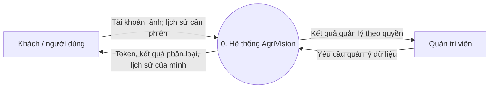

Khách được phân loại và xem kết quả của lượt hiện tại; chỉ lịch sử cá nhân cần phiên đăng nhập. Không cấp quyền đọc bản ghi tài khoản theo ID cho khách. Quyền quản trị đối với ảnh và dữ liệu cá nhân cần được giới hạn theo quyết định ở [đặc tả](system_requirements.md#6-quyết-định-còn-mở).

### 2.3. DFD mức 1 mục tiêu — luồng người dùng

Sơ đồ dưới đây phân rã các luồng tài khoản, phân loại và lịch sử. Mũi tên mang **dữ liệu**, không phải thứ tự gọi hàm. `D1`–`D3` là các nhóm dữ liệu trong cùng PostgreSQL: `D1` là tài khoản, `D2` là lượt dự đoán/ảnh/snapshot mục tiêu, `D3` là danh mục nhãn và nội dung kiểm duyệt. Cloud storage chỉ lưu ảnh; database lưu tham chiếu ảnh.

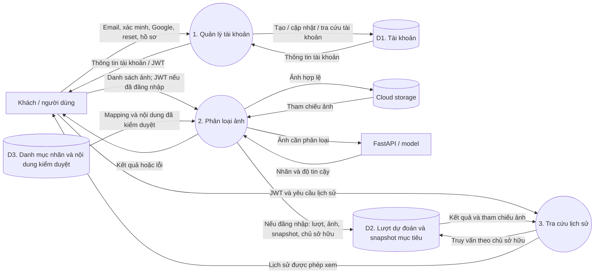

Tại tiến trình 2, API cho khách dự đoán theo US-01/AC-01; khi có phiên phải xác minh chủ sở hữu trước khi lưu lịch sử. Kiểm tổng dung lượng theo US-01/AC-02 và định dạng/nội dung từng ảnh; gộp theo US-01/AC-13–15, cảnh báo/quyền thuốc theo US-02, nội dung theo US-03. Chỉ kết quả thành công của phiên đăng nhập mới ghi `D2` cùng snapshot; lỗi AI không tạo bản ghi thành công. Mũi tên ghi D2 là luồng có điều kiện, không áp dụng khách. D2 ở đây là dữ liệu mục tiêu, chưa phải bảng hiện có. Cần xử lý ảnh đã tải lên nếu bước suy luận hoặc lưu DB thất bại. Tại tiến trình 3, API lọc theo chủ tài khoản trước khi trả bản ghi hoặc đường dẫn ảnh.

### 2.4. DFD mức 1 mục tiêu — luồng quản trị và hết hạn ảnh

Các tiến trình quản trị sau đây là **phương án thiết kế từ đặc tả cũ**, phạm vi/quyền cụ thể chưa được xác nhận trong phỏng vấn. `D1`–`D3` mang cùng ý nghĩa như sơ đồ ở phần 2.3; tên rút gọn của D2/D3 không loại bỏ yêu cầu nhiều ảnh, snapshot và nội dung kiểm duyệt. Chính sách ảnh hết hạn sau 30 ngày được giữ theo US-09/AC-07. Giữ lịch sử/snapshot sau khi ảnh hết hạn đã chốt ngày 2026-10-06; lịch chạy tác vụ và cách xử lý lỗi còn cần chốt.

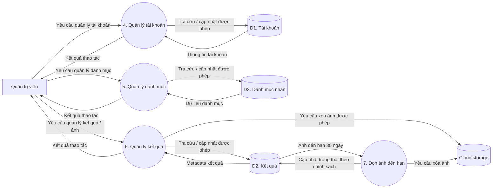

Popup xác nhận xóa là phương án giao diện chưa được chốt; server vẫn phải kiểm tra quyền và ràng buộc dữ liệu. Không xóa bản ghi lịch sử hoặc thay đổi khóa ngoại theo một quy tắc chưa được nhóm duyệt.

### 2.5. Activity, Sequence và State mục tiêu — chức năng cốt lõi

Các sơ đồ dưới đây mô tả **quy trình mục tiêu có phạm vi giới hạn**: đăng nhập email/mật khẩu, nhánh người đã đăng nhập phân loại một ảnh/xem kết quả, lịch sử/chi tiết/xóa của chính mình. Nhãn PLANNED chỉ rõ các bước chưa triển khai/hoàn thiện, không phải trạng thái chờ duyệt của yêu cầu nghiệp vụ. [Phạm vi, mapping và giải thích](reports/AGRI-76/core_target_workflows.md) · [gallery](reports/AGRI-76/diagrams/index.html#target_activity_authentication).

| Nhóm sơ đồ chi tiết | Nội dung đã vẽ | Giới hạn khi đối chiếu yêu cầu đã chốt |
|---|---|---|
| `target_*_authentication` | Email/mật khẩu, kiểm tài khoản, cấp JWT hoặc trả lỗi. | Chưa vẽ đăng ký/xác minh email, Google, quên/đặt lại mật khẩu và đăng xuất theo US-04–US-07. |
| `target_*_prediction` | Một ảnh, validation nhánh tài khoản, AI/strict mapping rồi mới lưu ảnh và ghi DB/image/snapshot; trả kết quả sau commit. | JWT/401 chỉ áp dụng nhánh tài khoản, POST khách vẫn public. Chưa vẽ nhánh khách/nhiều ảnh và toàn bộ cảnh báo/quyền thuốc/nội dung kiểm duyệt; snapshot đã thể hiện, UI field mới chưa đầy đủ. |
| `target_*_history` | List theo user, detail JWT/owner, snapshot hoặc legacy và ẩn URL hết hạn; xóa record cascade details/images. | UI phân trang/ảnh hết hạn và private storage còn thiếu; xác nhận/xóa ngay ảnh cloud là phương án, chưa chốt chính sách US-09. |

Quyền khách, giới hạn tổng dung lượng cả lượt và phép tổng hợp nhiều ảnh vẫn theo US-01; chính sách confidence/thuốc theo US-02. Bộ một ảnh chỉ mô tả phạm vi nhánh tài khoản, không thay thế QD-03/QD-04. Các bước đã có source được ghi đúng trạng thái, những nhánh sản phẩm chưa vẽ không tính là đã hoàn thiện. Baseline lịch sử được giữ riêng; bộ hiện tại đã đối chiếu source sau AGRI-70.

#### Activity Diagram

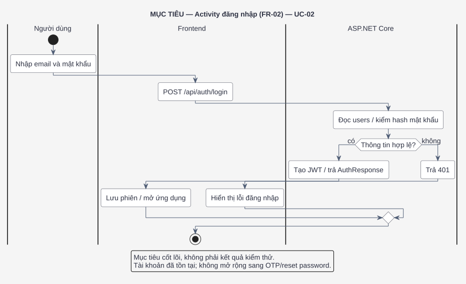

[Source editable](reports/AGRI-76/diagrams/target_activity_authentication.puml).

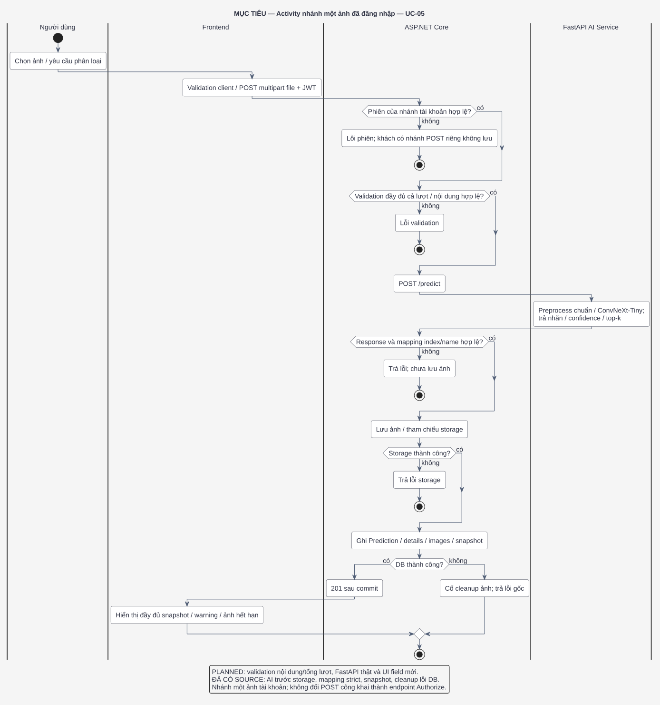

[Source editable](reports/AGRI-76/diagrams/target_activity_prediction.puml).

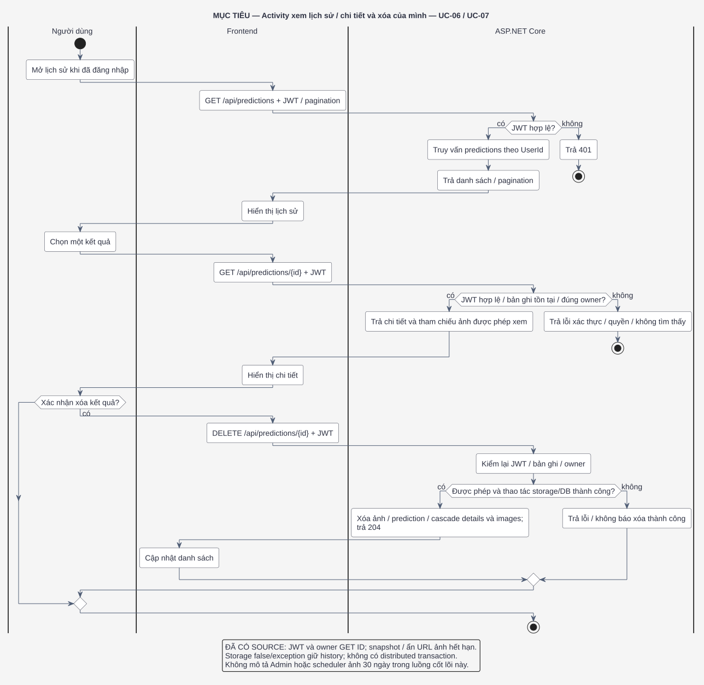

[Source editable](reports/AGRI-76/diagrams/target_activity_history.puml).

#### Sequence Diagram

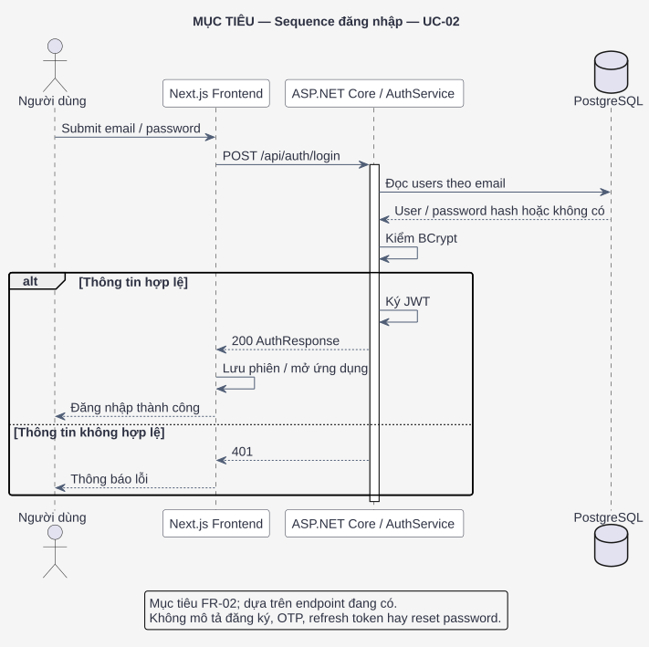

[Source editable](reports/AGRI-76/diagrams/target_sequence_authentication.puml).

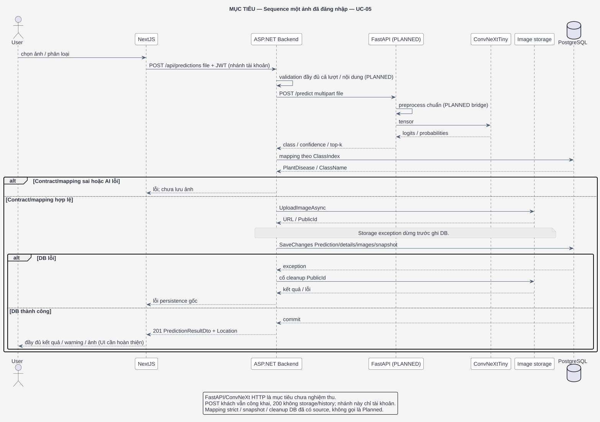

[Source editable](reports/AGRI-76/diagrams/target_sequence_prediction.puml).

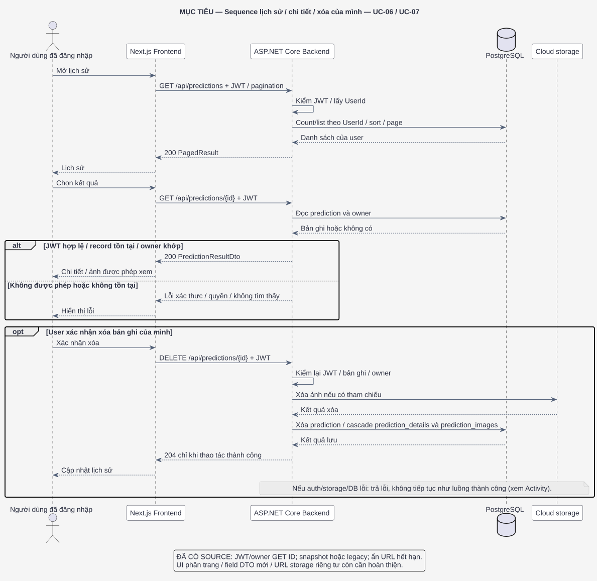

[Source editable](reports/AGRI-76/diagrams/target_sequence_history.puml).

#### State Diagram

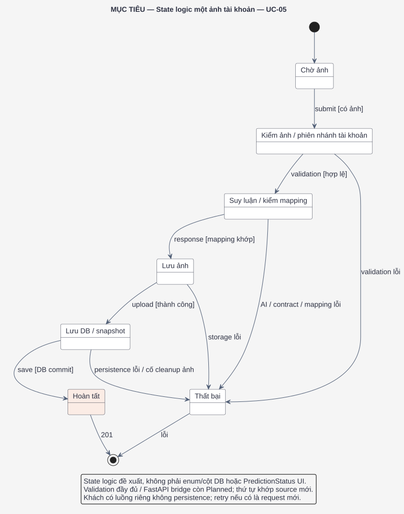

[Source editable](reports/AGRI-76/diagrams/target_state_prediction.puml). State là trạng thái **logic đề xuất của một lần xử lý một ảnh của tài khoản đã đăng nhập**, không phải lifecycle lưu trong DB. Trong nhánh đã vẽ, hoàn tất chỉ sau commit; lỗi không tạo kết quả thành công. Không áp điều kiện commit lịch sử cho khách vì khách không lưu lịch sử cá nhân. ERD/SQL hiện tại không có cột status và giữ nguyên.

## 3. ERD và cấu trúc dữ liệu hiện tại

### Schema hiện tại sau AGRI-70 — 07/10/2026

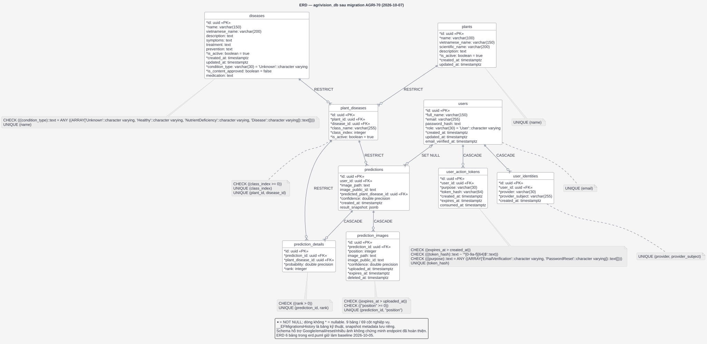

[Source editable](reports/AGRI-76/diagrams/erd_current.puml) · [Metadata live](reports/AGRI-76/assets/database_schema_current.json) · [DB verification](reports/AGRI-76/database_verification.md).
69 cột nghiệp vụ; prediction_images/user_identities/user_action_tokens bổ sung, snapshot JSONB
tên SQL result_snapshot, password hash nullable/email verified, condition/approval/medication.
Schema supporting không đồng nghĩa endpoint/UI hoàn thiện.

### Baseline lịch sử 6 bảng — giữ nguyên

Các hình Chen/Mermaid và bảng sáu entity bên dưới mô tả InitialCreate trước AGRI-70;
không dùng chúng làm schema nghiệm thu hiện tại.

### ERD khái niệm theo ký pháp Chen

Sơ đồ dưới đây dùng **hình chữ nhật cho thực thể, hình bầu dục cho thuộc tính và hình thoi cho quan hệ**, theo phong cách hình mẫu. Thuộc tính `id` được gạch chân để chỉ khóa chính. Sơ đồ chỉ giữ những thuộc tính tiêu biểu để dễ đọc; phần ERD bảng bên dưới liệt kê các trường còn lại.

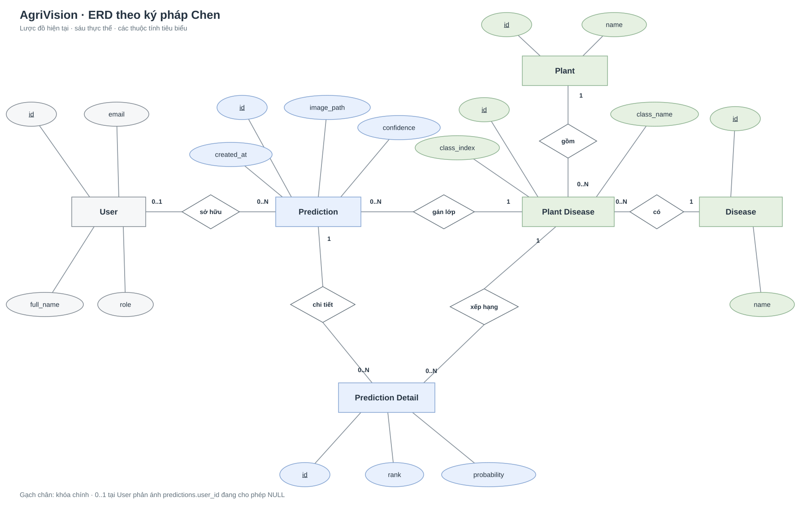

[Mở SVG ở kích thước đầy đủ](assets/agrivision_initial_create_chen_erd.svg). Bội số `0..1` ở phía `User` phản ánh `predictions.user_id` **đang cho phép NULL**. Mục tiêu cho khách dự đoán, nhưng chỉ tự lưu lịch sử cá nhân khi đã đăng nhập theo QD-01/QD-07. Tính nullable hiện tại không chứng minh đã đáp ứng chính sách này. Thiết kế lưu trữ mục tiêu và quy tắc xử lý dữ liệu cũ/xóa tài khoản cần được chốt trước khi đổi ràng buộc DB. Hai quan hệ tới `Prediction Detail` lần lượt biểu diễn bản ghi dự đoán sở hữu các hạng và mỗi hạng tham chiếu một lớp cây/bệnh.

### ERD bảng và ràng buộc baseline 05/10

Sơ đồ sau phản ánh sáu bảng trong [`InitialCreate` migration](../backend/src/AgriVision.Infrastructure/Persistence/Migrations/20260925161222_InitialCreate.cs) và [EF Core configurations](../backend/src/AgriVision.Infrastructure/Persistence/Configurations/). Các trường khóa và trường có ý nghĩa nghiệp vụ được thể hiện; bảng bên dưới bổ sung ràng buộc. `users` và `predictions` hiện là quan hệ tùy chọn do `user_id` cho phép `NULL`.

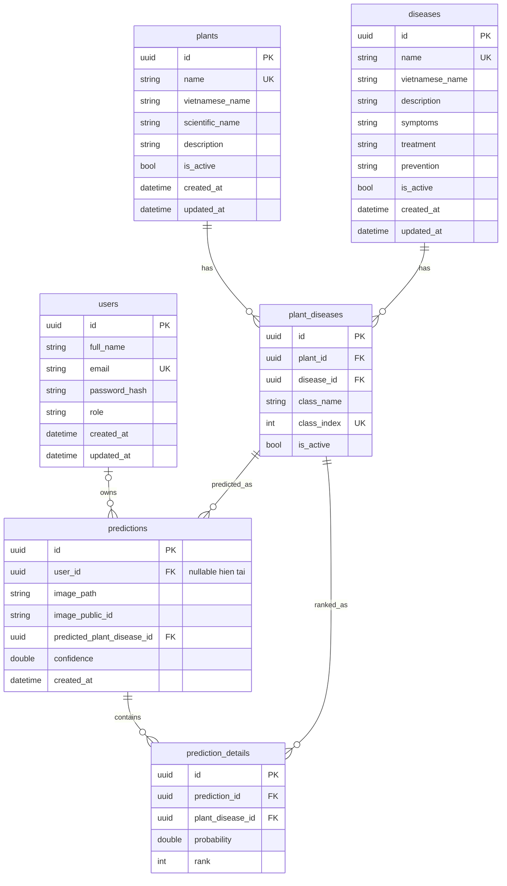

`UK` biểu thị unique index. `image_path` và `image_public_id` là tham chiếu tới nơi lưu ảnh, không phải dữ liệu ảnh nhị phân. `prediction_details` biểu diễn các lớp xếp hạng của **một ảnh**, không phải nhiều ảnh của một lần gửi.

| Bảng | Khóa, ràng buộc và mục đích hiện tại |
|---|---|
| `users` | PK `id`; `email` duy nhất; `role` mặc định `User`. Lưu thông tin tài khoản và hash mật khẩu. |
| `plants` | PK `id`; `name` duy nhất; danh mục cây. |
| `diseases` | PK `id`; `name` duy nhất; thông tin bệnh. Các cột `treatment`/`prevention` đã tồn tại; chưa đủ để chứng minh cơ chế kiểm duyệt/quyền hiển thị thuốc theo US-02/03. Gợi ý theo giai đoạn chưa thuộc phạm vi. |
| `plant_diseases` | PK `id`; FK tới cây/bệnh; duy nhất `(plant_id, disease_id)` và `class_index`; `class_index >= 0`. Lớp nhãn cần khớp mapping model được duyệt. |
| `predictions` | PK `id`; FK `user_id` hiện nullable, xóa user thì `SET NULL`; FK lớp dự đoán có `RESTRICT`; lưu tham chiếu một ảnh, confidence và thời điểm. |
| `prediction_details` | PK `id`; FK prediction `CASCADE`, FK lớp `RESTRICT`; `(prediction_id, rank)` duy nhất và `rank > 0`. |

### Điều chỉnh cần thiết so với yêu cầu mới

| Chủ đề | Hiện tại | Hướng điều chỉnh cần duyệt và triển khai |
|---|---|---|
| Khách và quyền lịch sử | `predictions.user_id` nullable; POST công khai; UI chặn khách. | Mở web dự đoán khách theo QD-01; không lưu lịch sử cá nhân cho khách. Kiểm owner ở các đường đọc ảnh/bản ghi tài khoản; không bắt buộc JWT trên POST chỉ để khớp đặc tả cũ. |
| Quyền xem kết quả | GET theo ID đã JWT/owner; URL storage chưa ACL đầy đủ. | Kiểm tra quyền trên server trước khi trả metadata và URL ảnh; chốt quyền admin. |
| Sửa hồ sơ | Có `/api/auth/me` để đọc; UC-03/F1.5 sửa hồ sơ UI chỉ đổi state, chưa có endpoint lưu DB; role UI không đổi JWT role. | Thêm thao tác lưu server cho các trường được duyệt, xác thực chủ tài khoản. |
| Nhiều ảnh | API vẫn một file/request; schema có prediction_images hỗ trợ quan hệ nhiều ảnh. | Contract danh sách ảnh, một kết quả chung theo US-01; lưu quan hệ lượt–ảnh, không dùng top-k details làm danh sách ảnh. Số ảnh tối đa chưa chốt. |
| Cloud và hạn lưu | Có Cloudinary/local và expiry 30 ngày, lệnh cleanup riêng giữ history/snapshot; chưa scheduler. | Đảm bảo ảnh sản phẩm lên cloud; thêm chính sách xóa 30 ngày và trạng thái ảnh đã hết hạn; kiểm tra ảnh và dung lượng ở server. |
| Vòng đời tài khoản | Xóa user hiện làm `predictions.user_id = NULL`. | Chốt xóa cứng, xóa mềm hay ẩn danh; quyết định xóa/giữ lịch sử, ảnh và cách tuân thủ quyền riêng tư rồi mới đổi FK. |
| Danh mục cây/bệnh | FK `RESTRICT` ngăn xóa khi còn quan hệ tham chiếu. | Ưu tiên ngừng sử dụng bằng `is_active` nếu cần giữ lịch sử; popup không thay ràng buộc DB. |
| Phiên bản model | Chưa có cột model/dataset version. | Chốt nguồn/version trước khi thêm migration; không dùng seed minh họa làm mapping thật. |

### Contract mới và thiết kế dữ liệu cần bổ sung

Theo [Yêu cầu mục tiêu](system_requirements.md), mục tiêu cần trạng thái xác minh email, mã có hạn/dùng một lần, danh tính Google; danh sách ảnh theo lượt; snapshot nội dung lịch sử. Schema/migration AGRI-70 đã có metadata auth/ảnh/snapshot; endpoint Google/email/reset/multi-image còn cần triển khai. ERD 9 bảng ở trên phản ánh dữ liệu hiện tại.

## 4. Nguồn đối chiếu trong repo

- [Entity](../backend/src/AgriVision.Domain/Entities/) và [migration đầu tiên](../backend/src/AgriVision.Infrastructure/Persistence/Migrations/20260925161222_InitialCreate.cs): bảng, khóa, quan hệ hiện có.
- [PredictionsController](../backend/src/AgriVision.API/Controllers/PredictionsController.cs), [AuthController](../backend/src/AgriVision.API/Controllers/AuthController.cs), [PredictionService](../backend/src/AgriVision.Application/Services/Implementations/PredictionService.cs): luồng API hiện tại.
- [CloudinaryImageStorage](../backend/src/AgriVision.Infrastructure/Services/CloudinaryImageStorage.cs), [FastApiPlantDiseasePredictor](../backend/src/AgriVision.Infrastructure/Services/FastApiPlantDiseasePredictor.cs): adapter đang có, không chứng minh checkpoint thật đã sẵn sàng.
- [PlantsController](../backend/src/AgriVision.API/Controllers/PlantsController.cs), [DiseasesController](../backend/src/AgriVision.API/Controllers/DiseasesController.cs), [HealthController](../backend/src/AgriVision.API/Controllers/HealthController.cs): phạm vi quản trị danh mục và health hiện có.
- [Lộ trình phát triển](development_roadmap.md): kế hoạch và bằng chứng CI theo commit, không thay cho nghiệm thu model thật.
